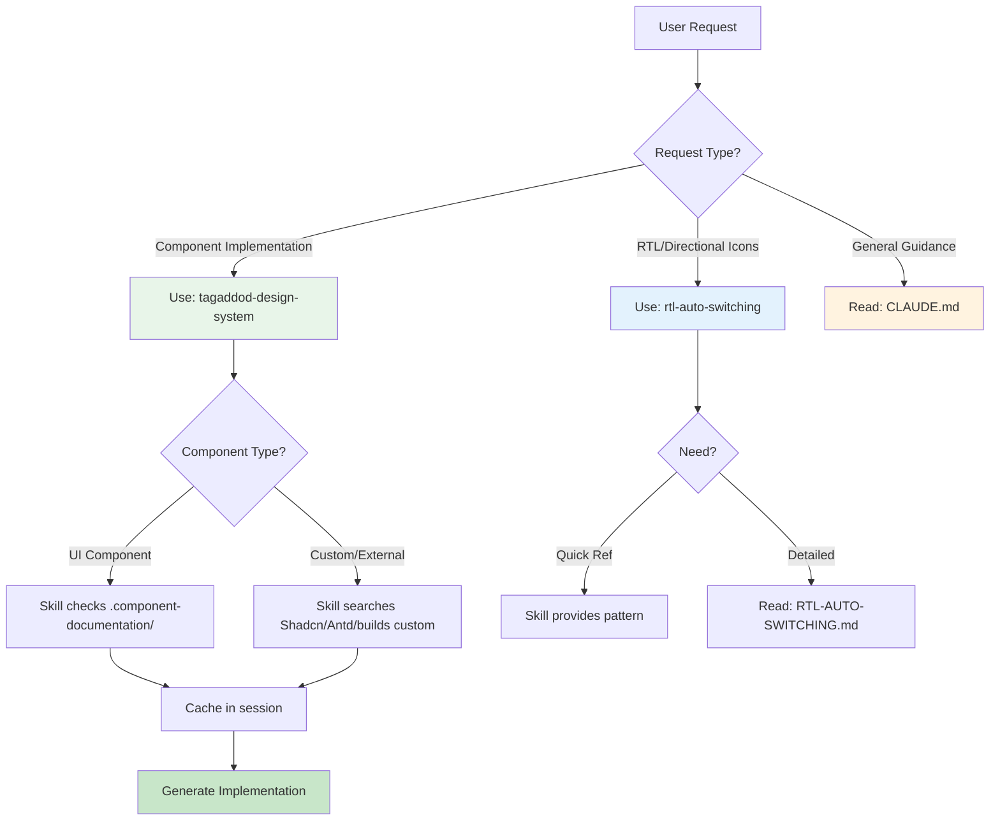

# Skills Index

**Last Updated**: 2025-10-19

All available Claude Code skills for the Tagaddod Design System template.

---

## 🎯 How to Use Skills

Skills are invoked using the Skill tool:

```
Uses Skill tool with command: "skill-name"
```

**Example**:
```
Uses Skill tool with command: "tagaddod-design-system"
```

---

## 📚 Available Skills

### 1. **tagaddod-design-system** (PRIMARY SKILL)

**Command**: `tagaddod-design-system`

**Purpose**: Component implementation with session-aware caching

**When to Use**:
- ANY component-related request
- Button, Modal, Table, Form implementations
- Layout components (Sidebar, TopBar, Drawer)
- Data display components (Table, Avatar, Badge)
- Navigation components (Tabs, Pagination, Listbox)
- Overlay components (Modal, Drawer, Popover)
- Arabic/RTL implementations

**Features**:
- ✅ Checks session memory before reading docs
- ✅ Reads `.component-documentation/[Component].mdx` ONCE per session
- ✅ Caches complete context (imports, props, examples, RTL patterns)
- ✅ Provides exact implementation patterns
- ✅ Falls back to Shadcn/Antd when component not found
- ✅ Applies Tagaddod design tokens automatically
- ✅ Supports 33 documented components

**Token Efficiency**:
- First request: ~2000 tokens (read + cache)
- Subsequent requests: ~50 tokens (cache only)
- **Savings**: 97.5% on repeated usage

**Location**: `.claude/skills/tagaddod-design-system/SKILL.md`

**Documentation Source**: `.component-documentation/` (33 component guides)

**Detailed Workflow**: `.design-system-guides/COMPONENT-DISCOVERY-WORKFLOW.md`

#### Example Usage

**Scenario 1**: First Button Request
```
User: "I need a button with loading state"
Agent: [Invokes tagaddod-design-system skill]
Skill Process:
  1. Check session memory: Button NOT FOUND
  2. Read .component-documentation/Button.mdx ONCE
  3. Extract ALL context (imports, props, examples)
  4. Cache in session memory
  5. Provide implementation: <Button loading={isLoading}>Submit</Button>
Result: Button context cached, implementation provided
```

**Scenario 2**: Second Button Request (Same Session)
```
User: "Another button with critical tone"
Agent: [Invokes tagaddod-design-system skill]
Skill Process:
  1. Check session memory: Button FOUND ✓
  2. Use cached context (NO file read)
  3. Provide implementation: <Button tone="critical">Delete</Button>
Result: Implementation provided in ~50 tokens (saved 2000 tokens)
```

---

### 2. **rtl-auto-switching**

**Command**: `rtl-auto-switching`

**Purpose**: Quick reference for RTL/LTR auto-switching in native Tagaddod components

**When to Use**:
- Need RTL implementation guidance for native Tagaddod components
- Directional icon selection questions
- Testing RTL switching
- Arabic/English bilingual implementations for native components
- Clarification on auto-switching behavior

**Features**:
- ✅ Universal auto-switching rule reference (native components only)
- ✅ Directional icon patterns (Next/Back/Expand/Collapse)
- ✅ Common mistake examples
- ✅ Testing strategies
- ✅ Component-by-component RTL behavior table for native Tagaddod components

**Quick Answers**:
- Do native Tagaddod components need manual RTL config? → **NO** (auto-switch)
- Do directional icons need manual selection? → **YES** (arrows/chevrons)
- How to test RTL? → `document.documentElement.dir = 'rtl'`
- Which components auto-switch? → **ALL native Tagaddod components**
- For custom components? → Use `rtl-custom-component-implementation` skill

**Location**: `.claude/skills/rtl-auto-switching/SKILL.md`

**Detailed Guide**: `.design-system-guides/RTL-AUTO-SWITCHING.md`

#### Example Usage

**Scenario 1**: RTL Sidebar Question
```
User: "How do I handle RTL for sidebar?"
Agent: [Invokes rtl-auto-switching skill]
Skill Response:
  - Sidebar auto-switches position (left → right in RTL)
  - NO manual configuration needed
  - Just use: <Sidebar selectedItem="dashboard" />
  - Automatically appears on RIGHT side in RTL
Result: Clear guidance, no manual config needed
```

**Scenario 2**: Directional Icon Question
```
User: "How do I handle arrow icons in RTL?"
Agent: [Invokes rtl-auto-switching skill]
Skill Response:
  - Directional icons require manual selection
  - Use useTheme() hook to detect isRTL
  - Example: const NextIcon = isRTL ? IconArrowLeft : IconArrowRight
  - Apply to Button: <Button suffixIcon={<NextIcon />}>Next</Button>
Result: Clear pattern for directional icon selection
```

---

### 3. **rtl-custom-component-implementation**

**Command**: `rtl-custom-component-implementation`

**Purpose**: Implement comprehensive RTL support for custom components (Tier 2-4 fallbacks)

**When to Use**:
- After Tier 1 check fails (component NOT in `.component-documentation/`)
- Adapting Shadcn components to Tagaddod with RTL
- Adapting Ant Design components to Tagaddod with RTL
- Building custom components from scratch that need RTL/Arabic support
- User explicitly requests Arabic/RTL for external components

**Features**:
- ✅ 6-step implementation workflow (line-height fix, logical properties, overrides, mirroring, tokens, verification)
- ✅ Proven line-height fix pattern (TypeScript + CSS)
- ✅ CSS logical properties reference (complete mapping)
- ✅ Design token integration for all styling
- ✅ Component category-specific patterns (forms, navigation, data display, layout, interactive)
- ✅ Reference files: `line-height-fix-patterns.md`, `css-logical-properties.md`
- ✅ Automatic integration with 4-tier discovery workflow

**Workflow Integration**:
```
Tier 1: Check Tagaddod native → NOT FOUND
    ↓
Tier 2: Search Shadcn → FOUND
    ↓
🔴 ACTIVATE RTL SKILL → Apply 6-step workflow
    ↓
Component with RTL support ✓
```

**Location**: `.claude/skills/rtl-custom-component-implementation/SKILL.md`

**Reference Files**:
- `references/line-height-fix-patterns.md` - Copy-paste ready TypeScript + CSS patterns
- `references/css-logical-properties.md` - Complete directional → logical property mapping

#### Example Usage

**Scenario 1**: Adapting Shadcn Alert Component
```
User: "I need an alert component with Arabic support"
Agent: [Invokes tagaddod-design-system skill]
Skill Process:
  1. Check Tagaddod docs: Alert NOT FOUND
  2. Search Shadcn: Alert component FOUND
  3. Invoke rtl-custom-component-implementation skill
RTL Skill Process:
  1. Apply line-height fix (isRTL detection + lineHeightStyle)
  2. Replace left/right with inline-start/end
  3. Add ::before/::after pseudo-element trimming
  4. Add :global([dir="rtl"]) overrides
  5. Apply Tagaddod design tokens
  6. Verify LTR ↔ RTL switching
Result: Shadcn Alert component with full RTL support + Tagaddod styling
```

**Scenario 2**: Building Custom Breadcrumb
```
User: "Create a custom breadcrumb with RTL"
Agent: [Invokes tagaddod-design-system skill]
Skill Process:
  1. Check Tagaddod docs: Breadcrumb NOT FOUND
  2. Check Shadcn: NOT FOUND
  3. Check Ant Design: NOT FOUND
  4. Build custom component → Invoke RTL skill
RTL Skill Process:
  1. Implement base breadcrumb with flexbox
  2. Apply line-height fix to all text elements
  3. Use CSS logical properties (margin-inline-start, etc.)
  4. Add separator flipping for RTL (/ → \ in Arabic)
  5. Apply Tagaddod tokens (spacing, colors, typography)
  6. Test with Arabic content
Result: Custom breadcrumb with native RTL behavior
```

**Scenario 3**: RTL for Existing Custom Component
```
User: "Add RTL support to my custom Kanban component"
Agent: [Invokes rtl-custom-component-implementation skill]
RTL Skill Process:
  1. Read Kanban component code
  2. Identify all text elements → Apply lineHeightStyle
  3. Replace directional CSS (left → inline-start, etc.)
  4. Add RTL-specific overrides
  5. Handle directional icons (arrows for drag)
  6. Ensure design tokens used throughout
  7. Verify column layout mirrors in RTL
Result: Existing component now fully RTL-compatible
```

---

## 🔗 Related Documentation

### Design System Guides

**Location**: `.design-system-guides/`

| Guide | Purpose | Lines |
|-------|---------|-------|
| **COMPONENT-DISCOVERY-WORKFLOW.md** | Complete 4-tier discovery, session caching, token efficiency | ~900 |
| **RTL-AUTO-SWITCHING.md** | Comprehensive RTL patterns and examples | ~450 |
| **OVERLAY-SYSTEM-GUIDE.md** | Z-index and overlay nesting | ~400 |

### Component Documentation

**Location**: `.component-documentation/`

**Total**: 34 files (33 component guides + 1 comprehensive token guide)

#### Featured Guide: Design Tokens

| Guide | Purpose | Lines | Location |
|-------|---------|-------|----------|
| **DesignTokens.mdx** | Complete token decision trees, workflows, and semantic color system (all 113 tokens) | ~1467 | `.component-documentation/DesignTokens.mdx` |

**Guide Structure:**
- Quick Navigation by Scenario (fast jump links)
- 6 Decision Trees with Mermaid flowcharts (text, fill, border, spacing, typography, radius)
- Complete Semantic Color System (113 tokens with if-then usage logic)
- Component Styling Workflows (button, card, form, modal, table, badge)
- 9 Anti-Patterns with corrections
- Quick Token Selection Checklist

**When to Use:**
- ANY custom styling task
- Building custom components (Tier 3)
- Applying colors, spacing, typography, borders
- Need token selection guidance

#### Component Guides (33 files)

**Categories**:
- **Forms**: Button, TextInput, Select, Checkbox, Switch, RangeSlider, RadioButton, DatePicker
- **Layout**: AspectRatio, Separator, Sidebar, TopBar, Page, Card, ScrollArea
- **Data**: Table, Avatar, Badge, Logo, Tooltip, Calendar, Number
- **Navigation**: Tabs, Listbox, Pagination
- **Overlays**: Modal, Drawer, Popover
- **Feedback**: Sonner (notifications)
- **System**: ThemeProvider, DesignTokens

---

## 📊 Skill Selection Flowchart



---

## 🎯 Best Practices

### Always Invoke Skills for:

1. ✅ **Component implementation requests**
   - "I need a button"
   - "Add a modal for confirmation"
   - "Create a data table with filters"
   - "Implement a sidebar navigation"

2. ✅ **RTL/Arabic implementation questions**
   - "How do I make this RTL?"
   - "Which components need manual RTL config?"
   - "How to handle Arabic text direction?"

3. ✅ **Directional icon selection**
   - "Which arrow icon for Next button in Arabic?"
   - "How to handle chevron icons in RTL?"

4. ✅ **Design token application**
   - Handled automatically by tagaddod-design-system skill
   - Applies tokens for all component implementations

### Read Documentation Directly for:

1. 📖 **General project setup** (CLAUDE.md)
   - Development commands
   - Project architecture
   - Path aliases

2. 📖 **Detailed discovery workflow** (COMPONENT-DISCOVERY-WORKFLOW.md)
   - 4-tier fallback strategy
   - Session memory deep dive
   - Token efficiency metrics

3. 📖 **Overlay nesting scenarios** (OVERLAY-SYSTEM-GUIDE.md)
   - Complex z-index examples
   - Troubleshooting overlay visibility

4. 📖 **Complete RTL patterns** (RTL-AUTO-SWITCHING.md)
   - All component RTL behaviors
   - Testing strategies
   - Common mistakes

### Session Memory Optimization:

1. 💾 **Skills automatically cache component context**
   - No manual cache management needed
   - Context persists throughout conversation

2. 💾 **No need to re-read documentation in same session**
   - First request: Reads and caches
   - Subsequent requests: Uses cache

3. 💾 **Trust the session memory**
   - It works automatically
   - Persists for entire conversation
   - Invalidates on file changes

4. 💾 **40x token efficiency improvement**
   - First request: ~2000 tokens
   - Subsequent requests: ~50 tokens
   - Average savings: 65% across session

---

## 📈 Token Efficiency Comparison

| Scenario | Without Skills | With Skills + Cache | Savings |
|----------|---------------|---------------------|---------|
| **Single Button** | 2000 tokens | 2000 tokens | 0% |
| **3 Buttons (same session)** | 6000 tokens | 2100 tokens | **65%** |
| **5 Components (mixed)** | 10000 tokens | 4200 tokens | **58%** |
| **10 Component requests** | 20000 tokens | 6500 tokens | **67.5%** |

**Key Insight**: The more component requests in a session, the higher the token efficiency.

---

## 🔄 Skill Update Log

| Date | Skill | Update |
|------|-------|--------|
| 2025-10-27 | rtl-custom-component-implementation | Registered and documented new RTL custom component skill |
| 2025-10-27 | SKILLS-INDEX | Added comprehensive documentation for 3rd skill |
| 2025-10-19 | rtl-auto-switching | Updated references to .design-system-guides/ |
| 2025-10-19 | tagaddod-design-system | Enhanced session memory caching documentation |
| 2025-10-19 | SKILLS-INDEX | Created comprehensive skills index with flowcharts |
| [Previous] | All skills | Initial creation |

---

## 📞 Skill Support

**Questions about skills?**
- **Orchestration**: Read `/apps/template-test/CLAUDE.md`
- **Skill Documentation**: Read `.claude/skills/[skill-name].md`
- **Comprehensive Guides**: Read `.design-system-guides/`

**Need a new skill?**
- Propose in project documentation
- Follow established skill creation patterns
- Add to this index when created
- Update CLAUDE.md references

---

## 🎯 Quick Reference

| I need... | Use this skill | Fallback documentation |
|-----------|----------------|------------------------|
| Button component | `tagaddod-design-system` | Button.mdx |
| Modal component | `tagaddod-design-system` | Modal.mdx |
| Table with filters | `tagaddod-design-system` | Table.mdx |
| RTL direction guidance | `rtl-auto-switching` | RTL-AUTO-SWITCHING.md |
| Directional icons | `rtl-auto-switching` | RTL-AUTO-SWITCHING.md |
| Custom component (not in Tagaddod) | `tagaddod-design-system` | COMPONENT-DISCOVERY-WORKFLOW.md |
| RTL for Shadcn/Antd component | `rtl-custom-component-implementation` | SKILL.md + references/ |
| RTL for custom-built component | `rtl-custom-component-implementation` | SKILL.md + references/ |
| Design tokens reference | (Read directly) | DesignTokens.mdx |
| Z-index nesting | (Auto-managed) | OVERLAY-SYSTEM-GUIDE.md |
| Development commands | (Read directly) | CLAUDE.md |

---

## 🎓 Learning Path for AI Agents

### Level 1: Getting Started

1. Read CLAUDE.md (TL;DR and Quick Reference sections)
2. Understand the #1 rule: Always invoke skills first
3. Learn the 5 mandatory rules (#1-#5 priorities)

### Level 2: Component Implementation

1. Practice invoking `tagaddod-design-system` skill
2. Understand session memory caching
3. Learn to recognize when cache is used vs new read
4. Study token efficiency gains

### Level 3: RTL Mastery

1. Invoke `rtl-auto-switching` skill for quick reference
2. Understand auto-switching vs manual config
3. Master directional icon selection patterns
4. Read RTL-AUTO-SWITCHING.md for comprehensive examples

### Level 4: Advanced Workflows

1. Study COMPONENT-DISCOVERY-WORKFLOW.md for 4-tier fallback
2. Understand external component integration (Shadcn/Antd)
3. Learn custom component creation patterns
4. Master design token application for all tiers

### Level 5: Expert Level

1. Troubleshoot overlay z-index scenarios (OVERLAY-SYSTEM-GUIDE.md)
2. Optimize token usage across sessions
3. Handle edge cases and complex compositions
4. Contribute to skill and documentation improvements

---

## 📊 Skill Performance Metrics

### tagaddod-design-system

- **Usage Frequency**: ⭐⭐⭐⭐⭐ (Very High - used for all component requests)
- **Token Efficiency**: ⭐⭐⭐⭐⭐ (97.5% savings on repeated usage)
- **Accuracy**: ⭐⭐⭐⭐⭐ (Based on actual documentation, never guessed)
- **Coverage**: 33 documented components + fallback to external libraries

### rtl-auto-switching

- **Usage Frequency**: ⭐⭐⭐ (Medium - used for RTL/Arabic requests)
- **Token Efficiency**: ⭐⭐⭐⭐ (Quick reference, minimal token usage)
- **Accuracy**: ⭐⭐⭐⭐⭐ (Clear auto-switching rules, no ambiguity)
- **Coverage**: All components + directional icon patterns

### rtl-custom-component-implementation

- **Usage Frequency**: ⭐⭐⭐⭐ (High - used for all Tier 2-4 custom component implementations)
- **Token Efficiency**: ⭐⭐⭐⭐⭐ (Comprehensive patterns prevent trial-and-error)
- **Accuracy**: ⭐⭐⭐⭐⭐ (Proven patterns from Tagaddod native components)
- **Coverage**: 6-step workflow + category-specific patterns + reference files

---

## 🎯 Summary

### Total Skills: 3 Active Skills

1. **tagaddod-design-system** - Primary component implementation skill
2. **rtl-auto-switching** - RTL/LTR pattern reference skill
3. **rtl-custom-component-implementation** - RTL support for custom components (Tier 2-4)

### Comprehensive Documentation System

- **3 Design System Guides** (.design-system-guides/)
- **34 Documentation Files** (.component-documentation/)
  - 33 Component Guides (Button, Table, Modal, etc.)
  - 1 Comprehensive Token Guide (DesignTokens.mdx - 1467 lines)
- **1 Orchestration Guide** (CLAUDE.md)
- **1 Skills Index** (This file)

### Token Efficiency

- **Average savings**: 60-70% across multi-request sessions
- **Cache hit rate**: ~90% for component requests in same session
- **Optimal workflow**: Invoke skill → Cache once → Reuse forever

### Key Success Factors

✅ Always invoke skills for component implementation
✅ Trust session memory - it caches automatically
✅ Directional icons only exception requiring manual config
✅ Design tokens applied automatically by skills
✅ RTL auto-switches - zero manual configuration

---

**Questions?** Refer to CLAUDE.md for orchestration or skill documentation files for detailed guidance.
