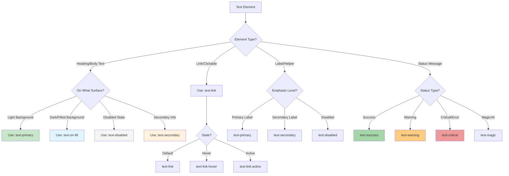
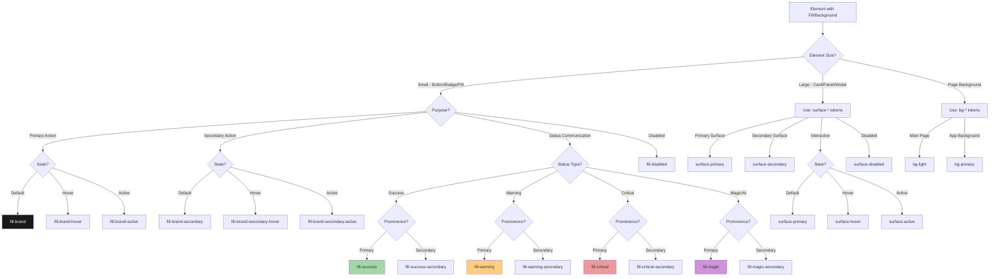
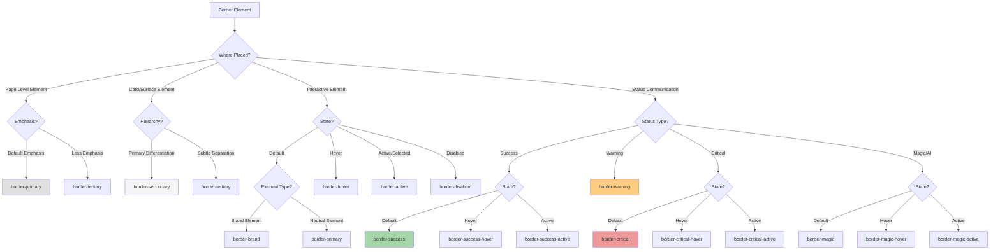
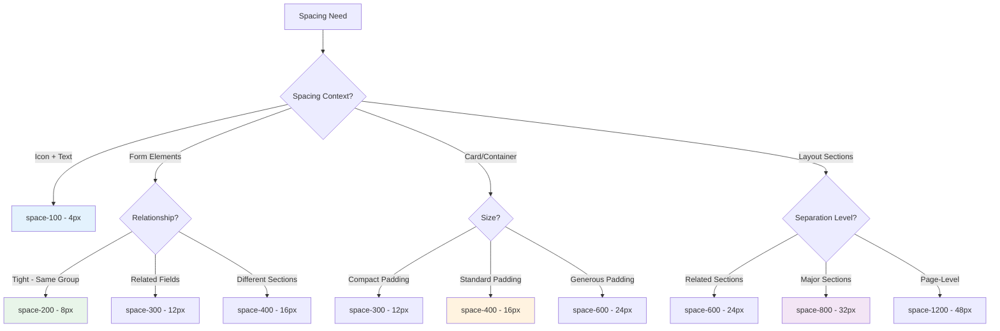
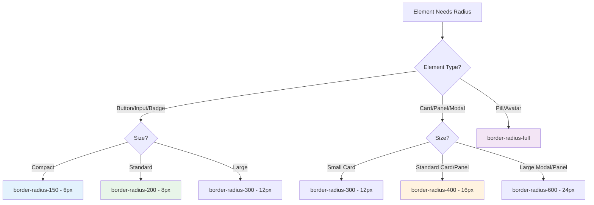

# Design Tokens - Complete AI Agent Guide

**Purpose**: Comprehensive token selection guide for AI agents building components and custom layouts in the Tagaddod Design System.

**Version**: 2.0 - Master Token Decision Guide
**Last Updated**: 2025-10-20

---

## 🎯 Quick Navigation (AI Agents Start Here)

**CRITICAL**: This guide provides decision-tree-based token selection for ALL styling tasks.

### Fast Jump Links by Scenario

| Scenario | Jump To | Line Range |
|----------|---------|------------|
| **"What color for text?"** | [Text Color Decision Tree](#text-color-decision-tree) | 150-250 |
| **"What color for button/badge?"** | [Fill Color Decision Tree](#fill-color-decision-tree) | 252-350 |
| **"What spacing between elements?"** | [Spacing Decision Tree](#spacing-decision-tree) | 450-550 |
| **"What typography for headings?"** | [Typography Decision Tree](#typography-decision-tree) | 600-700 |
| **"What border radius?"** | [Border Radius Decision Tree](#border-radius-decision-tree) | 750-850 |
| **"Building a button?"** | [Button Styling Workflow](#button-styling-workflow) | 1200-1300 |
| **"Building a card?"** | [Card Styling Workflow](#card-styling-workflow) | 1350-1450 |
| **"Building a form?"** | [Form Input Styling Workflow](#form-input-styling-workflow) | 1500-1600 |
| **"Complete token reference?"** | [Semantic Color Catalog](#semantic-color-system) | 900-1150 |

---

## 🚨 MANDATORY RULES FOR AI AGENTS

### Rule #1: Semantic Tokens ONLY
- ✅ ALWAYS use semantic tokens: `var(--t-color-text-primary)`
- ❌ NEVER use primitive palettes: `var(--t-color-blue-500)`
- ❌ NEVER hardcode values: `#333`, `16px`, `400`

### Rule #2: Decision Tree First
- ✅ ALWAYS consult decision trees before selecting tokens
- ✅ Follow if-then logic to correct token
- ❌ NEVER guess token names

### Rule #3: Token Hierarchy
```
1. Semantic Tokens (--t-color-text-primary) ← USE THESE
2. Primitive Tokens (--t-color-blue-500) ← ONLY for semantic overrides
3. Hardcoded Values (#333, 16px) ← FORBIDDEN
```

### Rule #4: Context Matters
- **Element type** (button vs text vs background)
- **Interactive state** (default vs hover vs active vs disabled)
- **Semantic meaning** (brand vs critical vs warning vs success)
- **Surface relationship** (on light vs on dark vs on filled)

### Rule #5: CSS Custom Properties
```css
/* ✅ CORRECT */
.button {
  background-color: var(--t-color-fill-brand);
  color: var(--t-color-text-on-fill);
  padding: var(--t-space-300);
  border-radius: var(--t-border-radius-150);
}

/* ❌ WRONG */
.button {
  background-color: #1A1A1D;
  color: white;
  padding: 12px;
  border-radius: 6px;
}
```

---

## 📊 TOKEN SELECTION DECISION TREES

### Text Color Decision Tree



### Text Color Token Reference

| Token | When to Use | Example |
|-------|-------------|---------|
| `--t-color-text-primary` | Main text on light surfaces (high contrast) | Headings, body text, labels |
| `--t-color-text-secondary` | Less emphasized text (descriptions, subtitles) | Help text, timestamps, metadata |
| `--t-color-text-disabled` | Disabled state text | Disabled buttons, inactive fields |
| `--t-color-text-on-fill` | Text on dark/colored backgrounds | Text on brand buttons, dark surfaces |
| `--t-color-text-on-fill-hover` | Text on hovered filled elements | Button text on hover |
| `--t-color-text-on-fill-active` | Text on active filled elements | Button text when pressed |
| `--t-color-text-on-fill-disabled` | Text on disabled filled elements | Disabled button text |
| `--t-color-text-link` | Clickable links | Hyperlinks, navigation links |
| `--t-color-text-link-hover` | Hovered links | Link hover state |
| `--t-color-text-link-active` | Active/pressed links | Link active state |
| `--t-color-text-success` | Success messages | "Saved successfully", checkmarks |
| `--t-color-text-success-hover` | Hovered success elements | Success button hover |
| `--t-color-text-success-active` | Active success elements | Success button pressed |
| `--t-color-text-success-secondary` | Secondary success text | Less prominent success info |
| `--t-color-text-critical` | Error/danger messages | Validation errors, warnings |
| `--t-color-text-critical-hover` | Hovered critical elements | Delete button hover |
| `--t-color-text-critical-active` | Active critical elements | Delete button pressed |
| `--t-color-text-critical-secondary` | Secondary error text | Less prominent error info |
| `--t-color-text-warning` | Warning messages | Caution notices, alerts |
| `--t-color-text-warning-secondary` | Secondary warning text | Less prominent warnings |
| `--t-color-text-magic` | AI-suggested text | AI recommendations |
| `--t-color-text-magic-hover` | Hovered AI elements | AI button hover |
| `--t-color-text-magic-active` | Active AI elements | AI button pressed |
| `--t-color-text-magic-secondary` | Secondary AI text | Less prominent AI info |

---

### Fill Color Decision Tree



### Fill/Background Color Token Reference

#### Background Tokens (Page Level)
| Token | When to Use | Example |
|-------|-------------|---------|
| `--t-color-bg-light` | Main page background, body tag | Full-page background |
| `--t-color-bg-primary` | Application background | Default app bg color |

#### Fill Tokens (Small Elements)
| Token | When to Use | Example |
|-------|-------------|---------|
| `--t-color-fill-primary` | Neutral filled elements | Generic buttons, badges |
| `--t-color-fill-hover` | Hovered neutral elements | Button hover |
| `--t-color-fill-active` | Active neutral elements | Button pressed |
| `--t-color-fill-disabled` | Disabled elements | Disabled button background |
| `--t-color-fill-brand` | Primary action buttons | Submit, CTA buttons |
| `--t-color-fill-brand-hover` | Hovered primary buttons | Primary button hover |
| `--t-color-fill-brand-active` | Active primary buttons | Primary button pressed |
| `--t-color-fill-brand-secondary` | Secondary brand elements | Outlined buttons, subtle badges |
| `--t-color-fill-brand-secondary-hover` | Hovered secondary brand | Outlined button hover |
| `--t-color-fill-brand-secondary-active` | Active secondary brand | Outlined button pressed |
| `--t-color-fill-success` | Success buttons/badges | Confirm, approve actions |
| `--t-color-fill-success-hover` | Hovered success elements | Success button hover |
| `--t-color-fill-success-active` | Active success elements | Success button pressed |
| `--t-color-fill-success-secondary` | Subtle success backgrounds | Success notification backgrounds |
| `--t-color-fill-success-secondary-hover` | Hovered subtle success | Success badge hover |
| `--t-color-fill-success-secondary-active` | Active subtle success | Success badge pressed |
| `--t-color-fill-critical` | Error/danger buttons | Delete, remove actions |
| `--t-color-fill-critical-hover` | Hovered critical elements | Delete button hover |
| `--t-color-fill-critical-active` | Active critical elements | Delete button pressed |
| `--t-color-fill-critical-secondary` | Subtle error backgrounds | Error notification backgrounds |
| `--t-color-fill-critical-secondary-hover` | Hovered subtle critical | Error badge hover |
| `--t-color-fill-critical-secondary-active` | Active subtle critical | Error badge pressed |
| `--t-color-fill-warning` | Warning buttons/badges | Caution actions |
| `--t-color-fill-warning-hover` | Hovered warning elements | Warning button hover |
| `--t-color-fill-warning-active` | Active warning elements | Warning button pressed |
| `--t-color-fill-warning-secondary` | Subtle warning backgrounds | Warning notification backgrounds |
| `--t-color-fill-warning-secondary-hover` | Hovered subtle warning | Warning badge hover |
| `--t-color-fill-warning-secondary-active` | Active subtle warning | Warning badge pressed |
| `--t-color-fill-magic` | AI-suggested buttons | AI feature buttons |
| `--t-color-fill-magic-hover` | Hovered AI elements | AI button hover |
| `--t-color-fill-magic-active` | Active AI elements | AI button pressed |
| `--t-color-fill-magic-secondary` | Subtle AI backgrounds | AI notification backgrounds |
| `--t-color-fill-magic-secondary-hover` | Hovered subtle AI | AI badge hover |
| `--t-color-fill-magic-secondary-active` | Active subtle AI | AI badge pressed |

#### Surface Tokens (Large Elements)
| Token | When to Use | Example |
|-------|-------------|---------|
| `--t-color-surface-primary` | Main cards, panels, modals | Card backgrounds |
| `--t-color-surface-hover` | Hovered surfaces | Clickable card hover |
| `--t-color-surface-active` | Active surfaces | Card pressed |
| `--t-color-surface-secondary` | Nested cards, secondary surfaces | Cards within cards |
| `--t-color-surface-secondary-hover` | Hovered secondary surfaces | Secondary card hover |
| `--t-color-surface-secondary-active` | Active secondary surfaces | Secondary card pressed |
| `--t-color-surface-disabled` | Disabled surfaces | Disabled card background |

---

### Border Color Decision Tree



### Border Color Token Reference

| Token | When to Use | Example |
|-------|-------------|---------|
| `--t-color-border-primary` | Default borders on page-level elements | Input borders, dividers on page |
| `--t-color-border-secondary` | Borders on surfaces/cards | Card borders, nested section borders |
| `--t-color-border-tertiary` | Subtle borders, less emphasis | Very light section dividers |
| `--t-color-border-hover` | Hovered element borders | Input hover, button hover border |
| `--t-color-border-active` | Active/selected element borders | Selected input, active tab |
| `--t-color-border-disabled` | Disabled element borders | Disabled input border |
| `--t-color-border-brand` | Brand-colored element borders | Primary button outline |
| `--t-color-border-brand-hover` | Hovered brand borders | Brand button hover border |
| `--t-color-border-brand-active` | Active brand borders | Brand button active border |
| `--t-color-border-success` | Success element borders | Success input border, valid state |
| `--t-color-border-success-hover` | Hovered success borders | Success button hover |
| `--t-color-border-success-active` | Active success borders | Success button pressed |
| `--t-color-border-critical` | Error/danger borders | Invalid input, error state |
| `--t-color-border-critical-hover` | Hovered critical borders | Delete button hover border |
| `--t-color-border-critical-active` | Active critical borders | Delete button pressed |
| `--t-color-border-warning` | Warning borders | Warning input, caution state |
| `--t-color-border-magic` | AI-suggested borders | AI feature borders |
| `--t-color-border-magic-hover` | Hovered AI borders | AI button hover border |
| `--t-color-border-magic-active` | Active AI borders | AI button pressed border |

---

### Spacing Decision Tree



### Spacing Token Reference

| Token | Pixel Value | When to Use | Example |
|-------|-------------|-------------|---------|
| `--t-space-0` | 0px | Remove spacing | Reset spacing |
| `--t-space-25` | 1px | Hairline gaps | Minimal separator |
| `--t-space-50` | 2px | Extra tight | Icon-text in compact button |
| `--t-space-100` | 4px | Tight spacing | Icon + text, badge padding |
| `--t-space-150` | 6px | Small gaps | Related elements |
| `--t-space-200` | 8px | **Base spacing (most common)** | Standard element gaps, form field spacing |
| `--t-space-250` | 10px | Small-medium | Compact button padding |
| `--t-space-300` | 12px | Medium spacing | Button padding, input padding |
| `--t-space-400` | 16px | Standard spacing | Card padding, section gaps |
| `--t-space-500` | 20px | Medium-large | Larger component padding |
| `--t-space-600` | 24px | Large spacing | Card padding, major section gaps |
| `--t-space-800` | 32px | Extra large | Prominent section separation |
| `--t-space-1000` | 40px | Very large | Major section separation |
| `--t-space-1200` | 48px | XX large | Page-level section gaps |
| `--t-space-1600` | 64px | Huge | Page-level padding |
| `--t-space-2000` | 80px | Very huge | Generous page margins |
| `--t-space-2400` | 96px | Massive | Dramatic page sections |
| `--t-space-3200` | 128px | Ultra massive | Hero sections |

**Common Patterns:**
- **Icon + Text**: `gap: var(--t-space-100)` (4px)
- **Form Field Gap**: `gap: var(--t-space-200)` (8px)
- **Button Padding**: `padding: var(--t-space-300) var(--t-space-400)` (12px 16px)
- **Card Padding**: `padding: var(--t-space-400)` (16px) or `var(--t-space-600)` (24px)
- **Section Gap**: `margin-bottom: var(--t-space-600)` (24px) or `var(--t-space-800)` (32px)

---

### Typography Decision Tree

```mermaid
flowchart TD
    Start[Text Content] --> Type{Content Type?}

    Type -->|Page Title| PageTitle[typography-heading-xl/2xl/3xl]
    Type -->|Section Heading| Section{Hierarchy?}
    Type -->|Body Text| Body{Size & Weight?}
    Type -->|Form Label| Label{Size & Emphasis?}
    Type -->|Helper/Caption| Caption{Size?}

    Section -->|H2 Level| SectionH2[typography-heading-lg/xl]
    Section -->|H3 Level| SectionH3[typography-heading-md]
    Section -->|H4 Level| SectionH4[typography-heading-sm/xs]

    Body -->|Large Body| BodyLarge{Weight?}
    Body -->|Standard Body| BodyStandard{Weight?}
    Body -->|Small Body| BodySmall{Weight?}

    BodyLarge -->|Regular| BodyLargeRegular[typography-body-xl]
    BodyLarge -->|Medium| BodyLargeMedium[typography-body-xl-medium]
    BodyLarge -->|Semibold| BodyLargeSemibold[typography-body-xl-semibold]

    BodyStandard -->|Regular| BodyStandardRegular[typography-body-md]
    BodyStandard -->|Medium| BodyStandardMedium[typography-body-md-medium]
    BodyStandard -->|Semibold| BodyStandardSemibold[typography-body-md-semibold]

    BodySmall -->|Regular| BodySmallRegular[typography-body-sm]
    BodySmall -->|Medium| BodySmallMedium[typography-body-sm-medium]
    BodySmall -->|Semibold| BodySmallSemibold[typography-body-sm-semibold]

    Label -->|Large Label| LabelLarge{Weight?}
    Label -->|Standard Label| LabelMedium{Weight?}
    Label -->|Small Label| LabelSmall{Weight?}

    LabelLarge -->|Medium| LabelLargeMedium[typography-label-lg]
    LabelLarge -->|Semibold| LabelLargeSemibold[typography-label-lg-semibold]

    LabelMedium -->|Medium| LabelMediumMedium[typography-label-md]
    LabelMedium -->|Semibold| LabelMediumSemibold[typography-label-md-semibold]

    LabelSmall -->|Medium| LabelSmallMedium[typography-label-sm]
    LabelSmall -->|Semibold| LabelSmallSemibold[typography-label-sm-semibold]

    Caption -->|Large| CaptionLarge[typography-caption-lg]
    Caption -->|Medium| CaptionMedium[typography-caption-md]
    Caption -->|Small| CaptionSmall[typography-caption-sm]

    style PageTitle fill:#e3f2fd
    style BodyStandardRegular fill:#e8f5e9
    style LabelMediumSemibold fill:#fff3e0
```



### Typography Token Reference

#### Headings
| Token | Size | Weight | When to Use | Example |
|-------|------|--------|-------------|---------|
| `--t-typography-heading-3xl` | 56px | Bold | Hero titles | Landing page hero |
| `--t-typography-heading-2xl` | 48px | Bold | Main page titles | Dashboard title |
| `--t-typography-heading-xl` | 40px | Bold | Primary headings | Section title |
| `--t-typography-heading-lg` | 32px | Bold | Secondary headings | Subsection title |
| `--t-typography-heading-md` | 24px | Bold | Tertiary headings | Card titles |
| `--t-typography-heading-sm` | 20px | Bold | Small headings | List section titles |
| `--t-typography-heading-xs` | 18px | Bold | Smallest headings | Compact section titles |

#### Body Text
| Token | Size | Weight | When to Use | Example |
|-------|------|--------|-------------|---------|
| `--t-typography-body-xl` | 20px | Regular | Large body text | Featured content |
| `--t-typography-body-xl-medium` | 20px | Medium | Emphasized large text | Important info |
| `--t-typography-body-xl-semibold` | 20px | Semibold | Strong large text | Key points |
| `--t-typography-body-lg` | 18px | Regular | Large body text | Article text |
| `--t-typography-body-lg-medium` | 18px | Medium | Emphasized text | Highlighted info |
| `--t-typography-body-lg-semibold` | 18px | Semibold | Strong text | Call-outs |
| `--t-typography-body-md` | 16px | Regular | **Standard body text** | Paragraphs, descriptions |
| `--t-typography-body-md-medium` | 16px | Medium | Emphasized standard text | Important details |
| `--t-typography-body-md-semibold` | 16px | Semibold | Strong standard text | Key information |
| `--t-typography-body-sm` | 14px | Regular | Small body text | Fine print |
| `--t-typography-body-sm-medium` | 14px | Medium | Emphasized small text | Secondary info |
| `--t-typography-body-sm-semibold` | 14px | Semibold | Strong small text | Small call-outs |

#### Labels & Form Text
| Token | Size | Weight | When to Use | Example |
|-------|------|--------|-------------|---------|
| `--t-typography-label-lg` | 16px | Medium | Large form labels | Primary form labels |
| `--t-typography-label-lg-semibold` | 16px | Semibold | Strong large labels | Required fields |
| `--t-typography-label-md` | 14px | Medium | **Standard form labels** | Input labels |
| `--t-typography-label-md-semibold` | 14px | Semibold | Strong standard labels | Important fields |
| `--t-typography-label-sm` | 12px | Medium | Small labels | Compact form labels |
| `--t-typography-label-sm-semibold` | 12px | Semibold | Strong small labels | Status labels |

#### Captions & Helper Text
| Token | Size | Weight | When to Use | Example |
|-------|------|--------|-------------|---------|
| `--t-typography-caption-lg` | 14px | Regular | Large captions | Photo captions |
| `--t-typography-caption-lg-medium` | 14px | Medium | Emphasized captions | Important notes |
| `--t-typography-caption-md` | 12px | Regular | Standard captions | Helper text, hints |
| `--t-typography-caption-md-medium` | 12px | Medium | Emphasized helper text | Warnings |
| `--t-typography-caption-sm` | 10px | Regular | Small captions | Timestamps, metadata |
| `--t-typography-caption-sm-semibold` | 10px | Semibold | Strong small captions | Status badges |

**Font Family Tokens:**
- `--t-font-family-primary`: Outfit (English)
- `--t-font-family-arabic`: Tajawal (Arabic)

---

### Border Radius Decision Tree



### Border Radius Token Reference

| Token | Pixel Value | When to Use | Example |
|-------|-------------|-------------|---------|
| `--t-border-radius-0` | 0px | Sharp corners | Rectangular elements |
| `--t-border-radius-50` | 2px | Very subtle rounding | Small badges, minimal design |
| `--t-border-radius-100` | 4px | Small rounding | Compact elements |
| `--t-border-radius-150` | 6px | **Standard components (primary choice)** | Buttons, inputs, dropdowns, small cards |
| `--t-border-radius-200` | 8px | **Standard components (common choice)** | Buttons, inputs, interactive elements |
| `--t-border-radius-300` | 12px | **Main surfaces** | Cards, panels, modals |
| `--t-border-radius-400` | 16px | **Large surfaces** | Main cards, large panels, dialogs |
| `--t-border-radius-600` | 24px | Extra large rounding | Highly rounded surfaces |
| `--t-border-radius-800` | 32px | Very large rounding | Oversized elements |
| `--t-border-radius-full` | 9999px | **Pill shape** | Pills, circular avatars, fully rounded buttons |

**Most Common Usage:**
- **Buttons/Inputs**: `border-radius-150` (6px) or `border-radius-200` (8px)
- **Cards/Panels**: `border-radius-300` (12px) or `border-radius-400` (16px)
- **Pills/Avatars**: `border-radius-full`

---

### Layout Tokens Reference

#### Box Shadows
| Token | When to Use | Example |
|-------|-------------|---------|
| `--t-shadow-1` | Subtle elevation | Cards, panels |
| `--t-shadow-2` | Medium elevation | Hovered cards |
| `--t-shadow-popover` | High elevation | Modals, popovers, dropdowns |

#### Border Widths
| Token | Pixel Value | When to Use | Example |
|-------|-------------|-------------|---------|
| `--t-border-width-25` | 1px | Standard borders | Input borders, card borders |
| `--t-border-width-50` | 2px | Medium borders | Focused states |
| `--t-border-width-75` | 3px | Thick borders | Strong emphasis |
| `--t-border-width-100` | 4px | Very thick borders | Maximum emphasis |
| `--t-border-width-icon` | 1.5px | Icon stroke width | Icon borders |

#### Z-Index Layers (Reference - Auto-Managed)
| Token | Value | Purpose |
|-------|-------|---------|
| `--t-z-base` | 0 | Base layer |
| `--t-z-dropdown` | 1000 | Dropdown menus |
| `--t-z-popover` | 1010 | Popovers |
| `--t-z-drawer` | 1020 | Drawers/side panels |
| `--t-z-modal` | 1050 | Modals/dialogs |
| `--t-z-modal-dropdown` | 1060 | Dropdowns inside modals |
| `--t-z-drawer-modal` | 1070 | Modals inside drawers |
| `--t-z-toast` | 1080 | Toast notifications |
| `--t-z-tooltip` | 1090 | Tooltips |

**Note**: Z-index is automatically managed by the overlay system. Do NOT manually configure z-index values.

#### Motion/Animation
| Token | Value | When to Use |
|-------|-------|-------------|
| `--t-duration-fast` | 150ms | Quick transitions |
| `--t-duration-base` | 300ms | Standard transitions |
| `--t-easing-in-out` | cubic-bezier(0.4, 0, 0.2, 1) | Smooth easing |
| `--t-transition-soft` | all 300ms easing-in-out | Ready-to-use transition |

---

## 🎨 SEMANTIC COLOR SYSTEM

Complete reference for all 113 semantic color tokens with usage guidance.

### Overview by Category

- **Border Colors**: 19 tokens (primary, secondary, tertiary, states, semantic)
- **Background Colors**: 2 tokens (page-level backgrounds)
- **Fill Colors**: 33 tokens (buttons, badges, small elements with states)
- **Surface Colors**: 7 tokens (cards, panels, large elements)
- **Overlay Colors**: 6 tokens (backdrop overlays)
- **Text Colors**: 26 tokens (all text scenarios)
- **Icon Colors**: 20 tokens (icon colors matching text patterns)

### Border Colors (19 tokens)

#### Neutral Border Tokens
| Token | Description | Usage Decision |
|-------|-------------|----------------|
| `--t-color-border-primary` | Default border on page-level elements | IF element placed directly on page → use this |
| `--t-color-border-secondary` | Border for cards/sections on surfaces | IF card/section on white background → use this |
| `--t-color-border-tertiary` | Subtle border, less emphasis | IF need subtle section differentiation → use this |
| `--t-color-border-hover` | Hover state border | IF any element + hover state → use this |
| `--t-color-border-active` | Active/selected border | IF element selected or active → use this |
| `--t-color-border-disabled` | Disabled border | IF element disabled → use this |

#### Semantic Border Tokens
| Token | Description | Usage Decision |
|-------|-------------|----------------|
| `--t-color-border-brand` | Brand-colored border | IF pairing with brand colors → use this |
| `--t-color-border-brand-hover` | Brand border hover | IF brand border + hover + interactive → use this |
| `--t-color-border-brand-active` | Brand border active | IF brand border + active state → use this |
| `--t-color-border-success` | Success border | IF communicating success → use this |
| `--t-color-border-success-hover` | Success border hover | IF success border + hover + interactive → use this |
| `--t-color-border-success-active` | Success border active | IF success border + active state → use this |
| `--t-color-border-critical` | Critical/error border | IF communicating error/danger → use this |
| `--t-color-border-critical-hover` | Critical border hover | IF error border + hover + interactive → use this |
| `--t-color-border-critical-active` | Critical border active | IF error border + active state → use this |
| `--t-color-border-warning` | Warning border | IF communicating warning → use this |
| `--t-color-border-magic` | AI-suggested border | IF AI-suggested element → use this |
| `--t-color-border-magic-hover` | AI border hover | IF AI border + hover + interactive → use this |
| `--t-color-border-magic-active` | AI border active | IF AI border + active state → use this |

### Background Colors (2 tokens)

| Token | Description | Usage Decision |
|-------|-------------|----------------|
| `--t-color-bg-primary` | Application/page background | IF main app background → use this |
| `--t-color-bg-light` | Main content/page body background | IF full-page or large surface background → use this |

### Fill Colors (33 tokens)

#### Neutral Fill Tokens
| Token | Description | Usage Decision |
|-------|-------------|----------------|
| `--t-color-fill-primary` | Small element background | IF button/badge + neutral → use this |
| `--t-color-fill-hover` | Neutral fill hover | IF neutral fill + hover → use this |
| `--t-color-fill-active` | Neutral fill active | IF neutral fill + pressed → use this |
| `--t-color-fill-disabled` | Disabled fill | IF element disabled → use this |

#### Brand Fill Tokens
| Token | Description | Usage Decision |
|-------|-------------|----------------|
| `--t-color-fill-brand` | Primary action button | IF primary action (submit, CTA) → use this |
| `--t-color-fill-brand-hover` | Brand fill hover | IF primary button + hover → use this |
| `--t-color-fill-brand-active` | Brand fill active | IF primary button + pressed → use this |
| `--t-color-fill-brand-secondary` | Secondary brand fill | IF outlined button or subtle brand → use this |
| `--t-color-fill-brand-secondary-hover` | Secondary brand hover | IF secondary brand + hover → use this |
| `--t-color-fill-brand-secondary-active` | Secondary brand active | IF secondary brand + pressed → use this |

#### Success Fill Tokens
| Token | Description | Usage Decision |
|-------|-------------|----------------|
| `--t-color-fill-success` | Success button/badge | IF communicating success + small element → use this |
| `--t-color-fill-success-hover` | Success fill hover | IF success fill + hover → use this |
| `--t-color-fill-success-active` | Success fill active | IF success fill + pressed → use this |
| `--t-color-fill-success-secondary` | Subtle success background | IF success + secondary prominence → use this |
| `--t-color-fill-success-secondary-hover` | Subtle success hover | IF secondary success + hover → use this |
| `--t-color-fill-success-secondary-active` | Subtle success active | IF secondary success + pressed → use this |

#### Critical Fill Tokens
| Token | Description | Usage Decision |
|-------|-------------|----------------|
| `--t-color-fill-critical` | Error/danger button | IF communicating error/danger + small element → use this |
| `--t-color-fill-critical-hover` | Critical fill hover | IF critical fill + hover → use this |
| `--t-color-fill-critical-active` | Critical fill active | IF critical fill + pressed → use this |
| `--t-color-fill-critical-secondary` | Subtle error background | IF error + secondary prominence → use this |
| `--t-color-fill-critical-secondary-hover` | Subtle critical hover | IF secondary critical + hover → use this |
| `--t-color-fill-critical-secondary-active` | Subtle critical active | IF secondary critical + pressed → use this |

#### Warning Fill Tokens
| Token | Description | Usage Decision |
|-------|-------------|----------------|
| `--t-color-fill-warning` | Warning button/badge | IF communicating warning + small element → use this |
| `--t-color-fill-warning-hover` | Warning fill hover | IF warning fill + hover → use this |
| `--t-color-fill-warning-active` | Warning fill active | IF warning fill + pressed → use this |
| `--t-color-fill-warning-secondary` | Subtle warning background | IF warning + secondary prominence → use this |
| `--t-color-fill-warning-secondary-hover` | Subtle warning hover | IF secondary warning + hover → use this |
| `--t-color-fill-warning-secondary-active` | Subtle warning active | IF secondary warning + pressed → use this |

#### Magic/AI Fill Tokens
| Token | Description | Usage Decision |
|-------|-------------|----------------|
| `--t-color-fill-magic` | AI-suggested button | IF AI feature + small element → use this |
| `--t-color-fill-magic-hover` | Magic fill hover | IF magic fill + hover → use this |
| `--t-color-fill-magic-active` | Magic fill active | IF magic fill + pressed → use this |
| `--t-color-fill-magic-secondary` | Subtle AI background | IF AI + secondary prominence → use this |
| `--t-color-fill-magic-secondary-hover` | Subtle magic hover | IF secondary magic + hover → use this |
| `--t-color-fill-magic-secondary-active` | Subtle magic active | IF secondary magic + pressed → use this |

### Surface Colors (7 tokens)

| Token | Description | Usage Decision |
|-------|-------------|----------------|
| `--t-color-surface-primary` | Main card/panel background | IF card, panel, modal → use this |
| `--t-color-surface-hover` | Surface hover | IF surface + hover + interactive → use this |
| `--t-color-surface-active` | Surface active | IF surface + pressed → use this |
| `--t-color-surface-secondary` | Nested surface | IF card within card → use this |
| `--t-color-surface-secondary-hover` | Secondary surface hover | IF nested surface + hover → use this |
| `--t-color-surface-secondary-active` | Secondary surface active | IF nested surface + pressed → use this |
| `--t-color-surface-disabled` | Disabled surface | IF surface disabled → use this |

### Overlay Colors (6 tokens)

| Token | Description | Usage Decision |
|-------|-------------|----------------|
| `--t-color-overlay-light-20` | 20% light overlay | IF subtle highlight on dark → use this |
| `--t-color-overlay-dark-12` | 12% dark overlay | IF subtle shadow on light → use this |
| `--t-color-overlay-dark-60` | 60% dark overlay | IF modal backdrop → use this |
| `--t-color-overlay-dark-70` | 70% dark overlay | IF drawer backdrop → use this |
| `--t-color-overlay-dark-85` | 85% dark overlay | IF strong backdrop emphasis → use this |
| `--t-color-overlay-brand-12` | 12% brand overlay | IF subtle brand emphasis on interactive → use this |

### Text Colors (26 tokens)

#### Neutral Text Tokens
| Token | Description | Usage Decision |
|-------|-------------|----------------|
| `--t-color-text-primary` | Main text on light surfaces | IF heading/body text + light background → use this |
| `--t-color-text-secondary` | Less emphasized text | IF description, helper text → use this |
| `--t-color-text-disabled` | Disabled text | IF text in disabled state → use this |
| `--t-color-text-on-fill` | Text on dark backgrounds | IF text on button, dark surface → use this |
| `--t-color-text-on-fill-hover` | On-fill text hover | IF text on filled + hover → use this |
| `--t-color-text-on-fill-active` | On-fill text active | IF text on filled + pressed → use this |
| `--t-color-text-on-fill-disabled` | On-fill text disabled | IF text on filled + disabled → use this |
| `--t-color-text-link` | Link text | IF clickable link → use this |
| `--t-color-text-link-hover` | Link hover | IF link + hover → use this |
| `--t-color-text-link-active` | Link active | IF link + pressed → use this |

#### Semantic Text Tokens
| Token | Description | Usage Decision |
|-------|-------------|----------------|
| `--t-color-text-success` | Success text | IF communicating success → use this |
| `--t-color-text-success-hover` | Success text hover | IF success text + hover + interactive → use this |
| `--t-color-text-success-active` | Success text active | IF success text + pressed → use this |
| `--t-color-text-success-secondary` | Secondary success text | IF success + secondary prominence → use this |
| `--t-color-text-critical` | Error/danger text | IF communicating error → use this |
| `--t-color-text-critical-hover` | Critical text hover | IF error text + hover + interactive → use this |
| `--t-color-text-critical-active` | Critical text active | IF error text + pressed → use this |
| `--t-color-text-critical-secondary` | Secondary critical text | IF error + secondary prominence → use this |
| `--t-color-text-warning` | Warning text | IF communicating warning → use this |
| `--t-color-text-warning-secondary` | Secondary warning text | IF warning + secondary prominence → use this |
| `--t-color-text-magic` | AI-suggested text | IF AI feature text → use this |
| `--t-color-text-magic-hover` | Magic text hover | IF AI text + hover + interactive → use this |
| `--t-color-text-magic-active` | Magic text active | IF AI text + pressed → use this |
| `--t-color-text-magic-secondary` | Secondary magic text | IF AI + secondary prominence → use this |

### Icon Colors (20 tokens)

Icon colors follow the same pattern as text colors. Use corresponding icon tokens for icons:

| Text Token | Icon Equivalent | Usage |
|------------|----------------|--------|
| `text-primary` | `icon-primary` | Default icons |
| `text-secondary` | `icon-secondary` | Secondary icons |
| `text-disabled` | `icon-disabled` | Disabled icons |
| `text-on-fill` | `icon-on-fill` | Icons on dark backgrounds |
| `text-on-fill-hover` | `icon-on-fill-hover` | Icons on hovered fills |
| `text-on-fill-active` | `icon-on-fill-active` | Icons on active fills |
| `text-on-fill-disabled` | `icon-on-fill-disabled` | Icons on disabled fills |
| `text-link` | `icon-link` | Icons in links |
| `text-link-hover` | `icon-link-hover` | Icons in hovered links |
| `text-link-active` | `icon-link-active` | Icons in active links |
| `text-success` | `icon-success` | Success icons |
| `text-success-hover` | `icon-success-hover` | Success icons hover |
| `text-success-active` | `icon-success-active` | Success icons active |
| `text-warning` | `icon-warning` | Warning icons |
| `text-warning` (dark variant) | `icon-warning-dark` | Warning icons on light backgrounds |
| `text-critical` | `icon-critical` | Error/danger icons |
| `text-critical-hover` | `icon-critical-hover` | Critical icons hover |
| `text-critical-active` | `icon-critical-active` | Critical icons active |
| `text-magic` | `icon-magic` | AI-suggested icons |
| `text-magic-hover` | `icon-magic-hover` | AI icons hover |
| `text-magic-active` | `icon-magic-active` | AI icons active |

---

## 🏗️ COMPONENT STYLING WORKFLOWS

Step-by-step token application for common component types.

### Button Styling Workflow

**Decision Process:**
1. Determine button purpose → brand, success, critical, warning, neutral
2. Determine variant → filled (primary), outlined (secondary), ghost
3. Apply state tokens → default, hover, active, disabled
4. Add layout tokens → padding, radius, typography

#### Primary Button (Filled, Brand)

```css
.button-primary {
  /* Fill */
  background-color: var(--t-color-fill-brand);

  /* Text */
  color: var(--t-color-text-on-fill);

  /* Border */
  border: var(--t-border-width-25) solid transparent;

  /* Layout */
  padding: var(--t-space-300) var(--t-space-400); /* 12px 16px */
  border-radius: var(--t-border-radius-150); /* 6px */

  /* Typography */
  font: var(--t-typography-label-md-semibold);

  /* Transition */
  transition: var(--t-transition-soft);
}

.button-primary:hover {
  background-color: var(--t-color-fill-brand-hover);
  color: var(--t-color-text-on-fill-hover);
}

.button-primary:active {
  background-color: var(--t-color-fill-brand-active);
  color: var(--t-color-text-on-fill-active);
}

.button-primary:disabled {
  background-color: var(--t-color-fill-disabled);
  color: var(--t-color-text-on-fill-disabled);
  cursor: not-allowed;
}
```

#### Secondary Button (Outlined)

```css
.button-secondary {
  /* Fill */
  background-color: var(--t-color-fill-brand-secondary);

  /* Text */
  color: var(--t-color-text-primary);

  /* Border */
  border: var(--t-border-width-25) solid var(--t-color-border-brand);

  /* Layout */
  padding: var(--t-space-300) var(--t-space-400);
  border-radius: var(--t-border-radius-150);

  /* Typography */
  font: var(--t-typography-label-md-semibold);

  /* Transition */
  transition: var(--t-transition-soft);
}

.button-secondary:hover {
  background-color: var(--t-color-fill-brand-secondary-hover);
  border-color: var(--t-color-border-brand-hover);
}

.button-secondary:active {
  background-color: var(--t-color-fill-brand-secondary-active);
  border-color: var(--t-color-border-brand-active);
}
```

#### Critical Button (Delete/Danger)

```css
.button-critical {
  background-color: var(--t-color-fill-critical);
  color: var(--t-color-text-on-fill);
  border: var(--t-border-width-25) solid transparent;
  padding: var(--t-space-300) var(--t-space-400);
  border-radius: var(--t-border-radius-150);
  font: var(--t-typography-label-md-semibold);
  transition: var(--t-transition-soft);
}

.button-critical:hover {
  background-color: var(--t-color-fill-critical-hover);
}

.button-critical:active {
  background-color: var(--t-color-fill-critical-active);
}
```

---

### Card Styling Workflow

**Decision Process:**
1. Determine if card is primary or nested → surface-primary vs surface-secondary
2. Add border (MANDATORY when using surface-primary) → border-secondary
3. Apply padding → space-400 or space-600
4. Add border radius → border-radius-300 or border-radius-400
5. Add shadow (optional) → shadow-1 or shadow-2

#### Primary Card

```css
.card {
  /* Surface */
  background-color: var(--t-color-surface-primary);

  /* Border (MANDATORY for cards) */
  border: var(--t-border-width-25) solid var(--t-color-border-secondary);

  /* Layout */
  padding: var(--t-space-400); /* 16px */
  border-radius: var(--t-border-radius-300); /* 12px */

  /* Shadow */
  box-shadow: var(--t-shadow-1);

  /* Transition */
  transition: var(--t-transition-soft);
}

.card:hover {
  background-color: var(--t-color-surface-hover);
  box-shadow: var(--t-shadow-2);
}
```

#### Nested Card (Card within Card)

```css
.card-nested {
  background-color: var(--t-color-surface-secondary);
  border: var(--t-border-width-25) solid var(--t-color-border-tertiary);
  padding: var(--t-space-300); /* 12px - smaller than parent */
  border-radius: var(--t-border-radius-200); /* 8px - smaller than parent */
}
```

#### Large Card/Panel

```css
.panel {
  background-color: var(--t-color-surface-primary);
  border: var(--t-border-width-25) solid var(--t-color-border-secondary);
  padding: var(--t-space-600); /* 24px */
  border-radius: var(--t-border-radius-400); /* 16px */
  box-shadow: var(--t-shadow-1);
}
```

---

### Form Input Styling Workflow

**Decision Process:**
1. Determine input state → default, focus, error, disabled
2. Apply background → fill-primary
3. Apply border → border-primary (default), border-active (focus), border-critical (error)
4. Apply padding → space-300
5. Apply typography → body-md

#### Text Input (Default State)

```css
.input {
  /* Fill */
  background-color: var(--t-color-fill-primary);

  /* Text */
  color: var(--t-color-text-primary);

  /* Border */
  border: var(--t-border-width-25) solid var(--t-color-border-primary);

  /* Layout */
  padding: var(--t-space-300); /* 12px */
  border-radius: var(--t-border-radius-150); /* 6px */

  /* Typography */
  font: var(--t-typography-body-md);

  /* Transition */
  transition: var(--t-transition-soft);
}

.input::placeholder {
  color: var(--t-color-text-secondary);
}

.input:hover {
  border-color: var(--t-color-border-hover);
}

.input:focus {
  border-color: var(--t-color-border-active);
  outline: none;
}

.input:disabled {
  background-color: var(--t-color-fill-disabled);
  border-color: var(--t-color-border-disabled);
  color: var(--t-color-text-disabled);
  cursor: not-allowed;
}

.input.error {
  border-color: var(--t-color-border-critical);
}

.input.success {
  border-color: var(--t-color-border-success);
}
```

#### Form Label

```css
.label {
  color: var(--t-color-text-primary);
  font: var(--t-typography-label-md-semibold);
  margin-bottom: var(--t-space-100); /* 4px */
}

.label.required::after {
  content: '*';
  color: var(--t-color-text-critical);
  margin-left: var(--t-space-50); /* 2px */
}
```

#### Form Helper Text

```css
.helper-text {
  color: var(--t-color-text-secondary);
  font: var(--t-typography-caption-md);
  margin-top: var(--t-space-100); /* 4px */
}

.helper-text.error {
  color: var(--t-color-text-critical);
}

.helper-text.success {
  color: var(--t-color-text-success);
}
```

---

### Modal/Dialog Styling Workflow

```css
.modal-overlay {
  background-color: var(--t-color-overlay-dark-70);
  /* Z-index auto-managed - don't set manually */
}

.modal {
  background-color: var(--t-color-surface-primary);
  border: var(--t-border-width-25) solid var(--t-color-border-secondary);
  border-radius: var(--t-border-radius-400); /* 16px */
  padding: var(--t-space-600); /* 24px */
  box-shadow: var(--t-shadow-popover);
  max-width: 500px;
}

.modal-header {
  margin-bottom: var(--t-space-400); /* 16px */
}

.modal-title {
  color: var(--t-color-text-primary);
  font: var(--t-typography-heading-md);
  margin: 0;
}

.modal-body {
  color: var(--t-color-text-primary);
  font: var(--t-typography-body-md);
  margin-bottom: var(--t-space-400);
}

.modal-footer {
  display: flex;
  gap: var(--t-space-200); /* 8px */
  justify-content: flex-end;
}
```

---

### Table Styling Workflow

```css
.table {
  width: 100%;
  background-color: var(--t-color-surface-primary);
  border: var(--t-border-width-25) solid var(--t-color-border-secondary);
  border-radius: var(--t-border-radius-300);
  overflow: hidden;
}

.table-header {
  background-color: var(--t-color-fill-primary);
  border-bottom: var(--t-border-width-25) solid var(--t-color-border-secondary);
}

.table-header-cell {
  padding: var(--t-space-300); /* 12px */
  color: var(--t-color-text-primary);
  font: var(--t-typography-label-md-semibold);
  text-align: left;
}

.table-row {
  border-bottom: var(--t-border-width-25) solid var(--t-color-border-tertiary);
  transition: var(--t-transition-soft);
}

.table-row:hover {
  background-color: var(--t-color-surface-hover);
}

.table-cell {
  padding: var(--t-space-300);
  color: var(--t-color-text-primary);
  font: var(--t-typography-body-sm);
}
```

---

### Badge Styling Workflow

```css
/* Success Badge */
.badge-success {
  background-color: var(--t-color-fill-success-secondary);
  color: var(--t-color-text-success-secondary);
  padding: var(--t-space-50) var(--t-space-200); /* 2px 8px */
  border-radius: var(--t-border-radius-full);
  font: var(--t-typography-caption-sm-semibold);
}

/* Warning Badge */
.badge-warning {
  background-color: var(--t-color-fill-warning-secondary);
  color: var(--t-color-text-warning-secondary);
  padding: var(--t-space-50) var(--t-space-200);
  border-radius: var(--t-border-radius-full);
  font: var(--t-typography-caption-sm-semibold);
}

/* Critical Badge */
.badge-critical {
  background-color: var(--t-color-fill-critical-secondary);
  color: var(--t-color-text-critical-secondary);
  padding: var(--t-space-50) var(--t-space-200);
  border-radius: var(--t-border-radius-full);
  font: var(--t-typography-caption-sm-semibold);
}
```

---

## 🚫 ANTI-PATTERNS

Common mistakes AI agents make when selecting tokens.

### ❌ ANTI-PATTERN #1: Using Primitive Palettes Directly

```css
/* ❌ WRONG - Using primitive palette */
.button {
  background-color: var(--t-color-blue-1600);
  color: var(--t-color-gray-100);
}

/* ✅ CORRECT - Using semantic tokens */
.button {
  background-color: var(--t-color-fill-brand);
  color: var(--t-color-text-on-fill);
}
```

**Why**: Semantic tokens adapt to theme changes, support dark mode, and maintain consistent meaning.

---

### ❌ ANTI-PATTERN #2: Hardcoding Values

```css
/* ❌ WRONG - Hardcoded values */
.card {
  padding: 16px;
  border-radius: 12px;
  color: #333333;
  box-shadow: 0 1px 3px rgba(0,0,0,0.1);
}

/* ✅ CORRECT - Using tokens */
.card {
  padding: var(--t-space-400);
  border-radius: var(--t-border-radius-300);
  color: var(--t-color-text-primary);
  box-shadow: var(--t-shadow-1);
}
```

**Why**: Tokens ensure consistency, theming support, and maintainability.

---

### ❌ ANTI-PATTERN #3: Wrong Semantic Token

```css
/* ❌ WRONG - Using fill token for large surface */
.card {
  background-color: var(--t-color-fill-primary);
}

/* ✅ CORRECT - Using surface token for cards */
.card {
  background-color: var(--t-color-surface-primary);
  border: var(--t-border-width-25) solid var(--t-color-border-secondary);
}
```

**Why**: Fill is for small elements (buttons, badges), surface is for large containers (cards, panels).

---

### ❌ ANTI-PATTERN #4: Forgetting Border on Cards

```css
/* ❌ WRONG - Surface without border */
.card {
  background-color: var(--t-color-surface-primary);
  padding: var(--t-space-400);
}

/* ✅ CORRECT - Always add border with surface-primary */
.card {
  background-color: var(--t-color-surface-primary);
  border: var(--t-border-width-25) solid var(--t-color-border-secondary);
  padding: var(--t-space-400);
}
```

**Why**: MANDATORY RULE - surface-primary ALWAYS requires border-secondary.

---

### ❌ ANTI-PATTERN #5: Wrong Text Color on Filled Backgrounds

```css
/* ❌ WRONG - Using primary text on dark background */
.button {
  background-color: var(--t-color-fill-brand);
  color: var(--t-color-text-primary); /* Low contrast! */
}

/* ✅ CORRECT - Using on-fill text for dark backgrounds */
.button {
  background-color: var(--t-color-fill-brand);
  color: var(--t-color-text-on-fill); /* High contrast */
}
```

**Why**: text-primary is for light surfaces, text-on-fill is for dark/colored surfaces.

---

### ❌ ANTI-PATTERN #6: Inconsistent Spacing Scale

```css
/* ❌ WRONG - Random spacing values */
.component {
  padding: 14px;
  margin: 18px;
  gap: 11px;
}

/* ✅ CORRECT - Using spacing scale */
.component {
  padding: var(--t-space-300); /* 12px */
  margin: var(--t-space-400); /* 16px */
  gap: var(--t-space-200); /* 8px */
}
```

**Why**: Spacing scale ensures visual rhythm and consistency.

---

### ❌ ANTI-PATTERN #7: Manual Z-Index Configuration

```css
/* ❌ WRONG - Manually setting z-index */
.modal {
  z-index: 9999;
}

.drawer {
  z-index: 9998;
}

/* ✅ CORRECT - Let the system handle it */
.modal {
  /* Z-index auto-managed by overlay system */
}
```

**Why**: Overlay system automatically manages z-index through React Context.

---

### ❌ ANTI-PATTERN #8: Using Typography Primitives Instead of Complete Tokens

```css
/* ❌ WRONG - Building typography manually */
.heading {
  font-family: var(--t-font-family-primary);
  font-size: var(--t-font-size-800);
  font-weight: var(--t-font-weight-bold);
  line-height: 1.2;
}

/* ✅ CORRECT - Using complete typography token */
.heading {
  font: var(--t-typography-heading-lg);
}
```

**Why**: Complete typography tokens include optimized line-height and all necessary properties.

---

### ❌ ANTI-PATTERN #9: Wrong Border Radius Scale

```css
/* ❌ WRONG - Using large radius for small elements */
.button {
  border-radius: var(--t-border-radius-400); /* 16px - too large! */
}

/* ✅ CORRECT - Using appropriate radius for buttons */
.button {
  border-radius: var(--t-border-radius-150); /* 6px - perfect for buttons */
}
```

**Why**: Small elements (buttons, inputs) use 6-8px, large surfaces (cards) use 12-16px.

---

## 📋 QUICK TOKEN SELECTION CHECKLIST

Use this checklist when applying tokens to any element:

### For ANY Element:

- [ ] Is this a text element? → Use [Text Color Decision Tree](#text-color-decision-tree)
- [ ] Is this a filled element (button, badge)? → Use [Fill Color Decision Tree](#fill-color-decision-tree)
- [ ] Is this a large surface (card, panel)? → Use [surface-* tokens](#surface-tokens-large-elements)
- [ ] Does it need a border? → Use [Border Color Decision Tree](#border-color-decision-tree)
- [ ] Does it need spacing? → Use [Spacing Decision Tree](#spacing-decision-tree)
- [ ] Does it need typography? → Use [Typography Decision Tree](#typography-decision-tree)
- [ ] Does it need border radius? → Use [Border Radius Decision Tree](#border-radius-decision-tree)

### For Cards Specifically:

- [ ] Background: `var(--t-color-surface-primary)`
- [ ] Border (MANDATORY): `var(--t-border-width-25) solid var(--t-color-border-secondary)`
- [ ] Padding: `var(--t-space-400)` or `var(--t-space-600)`
- [ ] Radius: `var(--t-border-radius-300)` or `var(--t-border-radius-400)`
- [ ] Shadow: `var(--t-shadow-1)` or `var(--t-shadow-2)`

### For Buttons Specifically:

- [ ] Determine purpose: brand, success, critical, warning, neutral
- [ ] Fill: `var(--t-color-fill-[purpose])`
- [ ] Text: `var(--t-color-text-on-fill)`
- [ ] Padding: `var(--t-space-300) var(--t-space-400)`
- [ ] Radius: `var(--t-border-radius-150)` (6px)
- [ ] Typography: `var(--t-typography-label-md-semibold)`
- [ ] States: hover, active, disabled variants

### For Form Inputs Specifically:

- [ ] Background: `var(--t-color-fill-primary)`
- [ ] Text: `var(--t-color-text-primary)`
- [ ] Border: `var(--t-color-border-primary)` (default)
- [ ] Border (focus): `var(--t-color-border-active)`
- [ ] Border (error): `var(--t-color-border-critical)`
- [ ] Padding: `var(--t-space-300)`
- [ ] Radius: `var(--t-border-radius-150)`
- [ ] Typography: `var(--t-typography-body-md)`

---

## 🎯 SUMMARY FOR AI AGENTS

### The Three Golden Rules:

1. **ALWAYS use semantic tokens** (`text-primary`, `fill-brand`, `surface-primary`)
2. **NEVER use primitive palettes** (`blue-500`, `gray-900`) or hardcoded values
3. **CONSULT decision trees FIRST** before selecting any token

### Most Common Tokens (80% of Use Cases):

**Colors:**
- `--t-color-text-primary` (main text)
- `--t-color-text-on-fill` (text on dark backgrounds)
- `--t-color-fill-brand` (primary buttons)
- `--t-color-surface-primary` (cards)
- `--t-color-border-secondary` (card borders)

**Spacing:**
- `--t-space-200` (8px - most common gap)
- `--t-space-300` (12px - button padding)
- `--t-space-400` (16px - card padding)
- `--t-space-600` (24px - section gaps)

**Typography:**
- `--t-typography-body-md` (standard text)
- `--t-typography-heading-md` (section titles)
- `--t-typography-label-md-semibold` (form labels, button text)

**Layout:**
- `--t-border-radius-150` (6px - buttons, inputs)
- `--t-border-radius-300` (12px - cards)
- `--t-border-width-25` (1px - standard border)

### Integration with Skills:

When the `tagaddod-design-system` skill builds custom components (Tier 4), it will:
1. Automatically read this guide
2. Navigate to relevant decision tree section
3. Follow if-then logic for token selection
4. Apply tokens according to component styling workflows
5. Ensure consistent token usage across all custom implementations

---

**End of Design Tokens Guide**

**For questions or updates, refer to the Tagaddod Design System documentation.**
