# Component Discovery Workflow

**Purpose**: Intelligent, session-aware component discovery with multi-tier fallback strategy

**Last Updated**: 2025-10-19

---

## 🎯 Core Principle: Read Once, Cache Forever

**Goal**: Maximize token efficiency by reading documentation ONCE per session, caching completely, and reusing indefinitely.

```
First Request:  Check Memory (MISS) → Read Documentation ONCE → Cache Context → Implement
Second Request: Check Memory (HIT)  → Use Cached Context → Implement (NO READ)
```

**Token Efficiency**: 40x improvement on repeated component usage

---

## 📋 Discovery Protocol Overview

### Step-by-Step Flow

```
1. User requests component
   ↓
2. Check session memory: Does component context exist?
   ├─ YES → Use cached context (skip to step 6)
   └─ NO  → Continue to step 3
   ↓
3. Check component existence: Does it exist in Tagaddod?
   ├─ YES → Tier 1: Read Tagaddod documentation
   └─ NO  → Tier 2-4: External fallback
   ↓
4. Read documentation ONCE (complete file)
   ↓
5. Cache ALL context in session memory
   ├─ Import patterns
   ├─ Props and types
   ├─ Usage examples
   ├─ Best practices
   └─ RTL/accessibility patterns
   ↓
6. Generate implementation using cached knowledge
   ↓
7. Context persists for entire session
```

### 📊 Visual Discovery Flow


---

## 🔍 Session Memory Management

### Intelligent Context Caching

**Session-Level Cache Structure** (Conceptual):

```javascript
SessionMemory = {
  components: {
    "Button": {
      source: "tagaddod",
      imports: ["import { Button } from '@tagaddod-design/react'"],
      props: {
        variant: ["primary", "secondary", "tertiary", "plain"],
        size: ["small", "medium", "large"],
        tone: ["default", "critical", "success"],
        loading: "boolean",
        disabled: "boolean",
        // ... all props
      },
      examples: [
        { title: "Primary Button", code: "<Button variant=\"primary\">Submit</Button>" },
        { title: "Loading State", code: "<Button loading={true}>Processing</Button>" },
        // ... all examples
      },
      patterns: {
        rtl: "Auto-switches with directional icon selection",
        accessibility: "Full keyboard navigation and ARIA support",
        // ... all patterns
      },
      lastRead: "2025-10-19T19:00:00Z",
      fileHash: "abc123..." // For change detection
    },
    "Modal": { ... },
    "CustomKanban": {
      source: "custom",
      // ... custom component context
    }
  }
}
```

### 📊 Visual Cache Structure


### Cache Persistence Rules

**Context persists throughout session when:**
- ✅ Documentation file unchanged
- ✅ Session still active
- ✅ No explicit user request to re-read

**Cache invalidated when:**
- ❌ Documentation file modified (hash changed)
- ❌ User explicitly requests refresh
- ❌ Session ends

### Token Efficiency Comparison

| Scenario | Without Cache | With Cache | Savings |
|----------|--------------|------------|---------|
| First Button request | 2000 tokens | 2000 tokens | 0% |
| Second Button request | 2000 tokens | 50 tokens | **97.5%** |
| Third Button request | 2000 tokens | 50 tokens | **97.5%** |
| **Total (3 requests)** | 6000 tokens | 2100 tokens | **65%** |

### 📊 Token Efficiency Visualization

```mermaid
graph LR
    subgraph Without Cache
        W1[Request 1<br/>2000 tokens] --> W2[Request 2<br/>2000 tokens]
        W2 --> W3[Request 3<br/>2000 tokens]
        W3 --> WT[Total: 6000 tokens]
    end

    subgraph With Cache
        C1[Request 1<br/>2000 tokens<br/>Read + Cache] --> C2[Request 2<br/>50 tokens<br/>Cache Hit]
        C2 --> C3[Request 3<br/>50 tokens<br/>Cache Hit]
        C3 --> CT[Total: 2100 tokens<br/>65% savings ✓]
    end

    style W1 fill:#ffebee
    style W2 fill:#ffebee
    style W3 fill:#ffebee
    style WT fill:#ffcdd2
    style C1 fill:#fff3e0
    style C2 fill:#e8f5e9
    style C3 fill:#e8f5e9
    style CT fill:#c8e6c9
```



---

## 📦 Tier 1: Native Tagaddod Components

### When to Use

Component exists in `.component-documentation/` directory

### Discovery Process

**Step 1: Check Session Memory**

```
IF sessionMemory.components["ComponentName"] EXISTS:
  → Use cached context
  → Skip to implementation
ELSE:
  → Proceed to Step 2
```

**Step 2: Locate Documentation**

```
Check: .component-documentation/[ComponentName].mdx
├─ File EXISTS → Proceed to Step 3
└─ File NOT FOUND → Proceed to Tier 2 (Shadcn fallback)
```

**Step 3: Comprehensive Read**

```
READ ENTIRE .component-documentation/[ComponentName].mdx file:
├─ Import patterns (exact syntax)
├─ Component props (all options, types, defaults)
├─ Usage examples (basic, advanced, edge cases)
├─ RTL/Arabic support patterns
├─ Accessibility guidelines
├─ Integration with other components
├─ Common mistakes and solutions
└─ Best practices
```

**Important**: Always read the COMPLETE file. Partial reads risk missing critical information.

**Step 4: Cache Complete Context**

```
Store in sessionMemory.components["ComponentName"]:
{
  source: "tagaddod",
  imports: [extracted import patterns],
  props: {extracted all props with types},
  examples: [extracted all examples],
  patterns: {
    rtl: [RTL-specific guidance],
    accessibility: [A11y patterns],
    integration: [Component composition patterns]
  },
  lastRead: [current timestamp],
  fileHash: [file content hash for change detection]
}
```

**Step 5: Generate Implementation**

Use cached context to generate:
- Correct imports
- Proper prop usage
- Appropriate examples
- RTL support when needed
- Accessibility features

### Example: Button Component Discovery

**First Request**: "I need a primary button"

```
1. Check memory: Button context NOT FOUND
2. Read: .component-documentation/Button.mdx (complete file, ~500 lines)
3. Extract & Cache:
   - Imports: import { Button } from '@tagaddod-design/react'
   - Props: variant, size, tone, loading, disabled, prefixIcon, suffixIcon
   - Examples: 15+ usage patterns
   - RTL: Directional icon selection pattern
4. Generate: <Button variant="primary">Submit</Button>
5. Cache persists in session
```

**Second Request**: "Add a button with loading state"

```
1. Check memory: Button context FOUND in cache
2. Use cached props: loading={boolean}
3. Use cached example: Button with loading
4. Generate: <Button variant="primary" loading={isLoading}>Submit</Button>
5. NO file read (saved ~500 lines = 2000 tokens)
```

### Available Tagaddod Components

Components with documentation in `.component-documentation/`:

**Forms**:
- Button, TextInput, Select, Checkbox, Switch, RangeSlider, RadioButton, DatePicker

**Layout**:
- AspectRatio, Separator, Sidebar, TopBar, Page, Card, ScrollArea

**Data Display**:
- Table, Avatar, Badge, Logo, Tooltip

**Navigation**:
- Tabs, Listbox, Pagination

**Overlays**:
- Modal, Drawer, Popover

**Feedback**:
- Sonner (notifications), Number

**System**:
- ThemeProvider, DesignTokens

**Total**: 33 component guides

---

## 🔧 Tier 2: Shadcn Components (First Fallback)

### When to Use

Tagaddod component NOT found in `.component-documentation/`

### Discovery Process

**Step 1: Search for Shadcn Component**

**Step 1a: Try Shadcn MCP First (Priority)**
```
Tool: mcp__shadcn__* (Shadcn MCP tools)
Action: Query Shadcn component library via MCP
```

**Step 1b: Fallback to Web Search (If MCP Unavailable/Fails)**
```
Search Query: "shadcn [component-name] 2025 latest implementation react"
Tools: mcp__tavily-mcp__tavily-search, WebSearch, or mcp__brave-search__*
```

**Step 2: Extract Documentation**

Parse Shadcn documentation for:
- Component implementation patterns
- Installation instructions
- Props and configuration
- Usage examples
- TypeScript integration
- Accessibility features

**Step 3: Apply Tagaddod Design Tokens**

**CRITICAL**: External components MUST use Tagaddod design tokens

```tsx
// ❌ WRONG - Shadcn default styling
<ShadcnComponent className="bg-blue-500 text-white p-4" />

// ✅ CORRECT - Tagaddod tokens applied
<ShadcnComponent
  style={{
    backgroundColor: 'var(--t-color-fill-brand-primary)',
    color: 'var(--t-color-text-inverse)',
    padding: 'var(--t-space-400)'
  }}
/>
```

**Step 4: Cache Context**

```
Store in sessionMemory.components["ComponentName"]:
{
  source: "shadcn",
  installation: [installation steps],
  imports: [extracted import patterns],
  props: {extracted props},
  tokenMapping: {
    colors: "Use var(--t-color-*)",
    spacing: "Use var(--t-space-*)",
    typography: "Use var(--t-typography-*)"
  },
  examples: [adapted examples with Tagaddod tokens]
}
```

**Step 5: Generate Implementation**

Create component using:
- Shadcn base implementation
- Tagaddod design tokens overlay
- Consistent visual language

### Example: Carousel Component (Not in Tagaddod)

```
1. Check Tagaddod docs: Carousel.mdx NOT FOUND
2a. Try Shadcn MCP: Query via mcp__shadcn__* tools
2b. If MCP fails: Web search "shadcn carousel 2025 latest implementation react"
3. Extract Shadcn carousel documentation
4. Apply Tagaddod tokens:
   - Colors: var(--t-color-border-primary)
   - Spacing: var(--t-space-400)
   - Typography: var(--t-typography-body-md-default)
5. Cache adapted component context
6. Generate: Carousel with Tagaddod styling
```

---

## 🎨 Tier 3: Antd Components (Second Fallback)

### When to Use

Shadcn component NOT suitable or NOT found

### Discovery Process

**Step 1: Web Search for Ant Design**

```
Search Query: "antdesign [component-name] react 2025 best practices implementation"
```

**Step 2: Extract Documentation**

Focus on:
- Modern React implementation (hooks, functional components)
- TypeScript integration
- Accessibility features
- Customization options
- Performance considerations

**Step 3: Adapt to Tagaddod**

Convert Ant Design patterns to Tagaddod design language:

```tsx
// Antd default
<AntdComponent
  style={{
    color: '#1890ff',
    fontSize: '14px',
    margin: '16px'
  }}
/>

// Adapted to Tagaddod
<AntdComponent
  style={{
    color: 'var(--t-color-fill-brand-primary)',
    fontSize: 'var(--t-font-size-400)',
    margin: 'var(--t-space-400)'
  }}
/>
```

**Step 4: Cache & Implement**

Similar to Tier 2, cache context and generate implementation with Tagaddod tokens.

---

## 🔨 Tier 4: Universal Web Components (Final Fallback)

### When to Use

No external library component suitable

### Discovery Process

**Step 1: Best Practices Research**

```
Search Query: "react [component-name] component best practices 2025 accessibility"
```

**Step 2: Research Focus Areas**

- Modern React patterns (hooks, functional components)
- Accessibility standards (ARIA, keyboard navigation)
- Performance optimization techniques
- TypeScript integration
- State management patterns

**Step 3: Custom Component Architecture**

Build from scratch using atomic design principles:

```
1. Create atomic components (buttons, inputs, labels)
2. Build molecular components (form fields, cards, list items)
3. Compose organism components (forms, tables, navigation bars)
4. Apply Tagaddod design tokens throughout
5. Implement RTL support
6. Add accessibility features
```

**Step 4: Component Structure**

```
src/components/custom/[category]/[ComponentName]/
├── ComponentName.tsx          # Main component
├── ComponentName.types.ts     # TypeScript interfaces
├── ComponentName.styles.css   # Styles with design tokens
├── ComponentName.test.tsx     # Unit tests
└── index.ts                   # Clean exports
```

**Step 5: Design Token Integration**

```css
/* ComponentName.styles.css */
.component {
  /* Colors */
  background-color: var(--t-color-surface-primary);
  color: var(--t-color-text-primary);
  border: 1px solid var(--t-color-border-primary);

  /* Spacing */
  padding: var(--t-space-400);
  margin: var(--t-space-200);
  gap: var(--t-space-300);

  /* Typography */
  font: var(--t-typography-body-md-default);

  /* Layout */
  border-radius: var(--t-border-radius-200);
  box-shadow: var(--t-shadow-200);
}
```

**Step 6: Cache & Document**

```
Store in sessionMemory.components["ComponentName"]:
{
  source: "custom",
  location: "src/components/custom/[category]/[ComponentName]",
  architecture: "atomic design",
  tokens: "Tagaddod design tokens applied",
  rtl: "RTL support implemented",
  accessibility: "WCAG 2.1 AA compliant"
}
```

### Example: Kanban Board (Custom Component)

```
1. Check all tiers: NOT FOUND in Tagaddod, Shadcn, Antd
2. Search: "react kanban board component best practices 2025"
3. Research: Drag-and-drop libraries (dnd-kit), state patterns
4. Design:
   - Atomic: KanbanCard, KanbanColumn, KanbanHeader
   - Molecular: KanbanLane (column + cards)
   - Organism: KanbanBoard (all lanes + drag-drop)
5. Apply tokens:
   - Card: var(--t-color-surface-primary), var(--t-space-400)
   - Column: var(--t-color-border-secondary), var(--t-border-radius-200)
6. Cache custom component context
7. Generate: Fully functional Kanban with Tagaddod styling
```

---

## 🎨 Design Token Integration (All Tiers)

### Mandatory Token Application

**For ALL components (Tier 1-4), ALWAYS apply Tagaddod design tokens:**

#### Step 1: Check Design Tokens Documentation

```
BEFORE applying ANY styles:
Read: .component-documentation/DesignTokens.mdx
```

#### Step 2: Token Categories

**Colors**:
```css
var(--t-color-fill-brand-primary)     /* Primary brand color */
var(--t-color-text-primary)           /* Primary text */
var(--t-color-border-secondary)       /* Secondary borders */
var(--t-color-surface-primary)        /* Primary surface/background */
```

**Spacing** (0-3200):
```css
var(--t-space-100)   /* 4px */
var(--t-space-200)   /* 8px */
var(--t-space-300)   /* 12px */
var(--t-space-400)   /* 16px */
var(--t-space-600)   /* 24px */
var(--t-space-800)   /* 32px */
```

**Typography**:
```css
var(--t-typography-heading-lg-semibold)
var(--t-typography-body-md-default)
var(--t-font-family-primary)         /* Outfit (English) */
var(--t-font-family-arabic)          /* Tajawal (Arabic) */
```

**Layout**:
```css
var(--t-border-radius-200)           /* 8px */
var(--t-shadow-200)                  /* Elevation shadow */
```

#### Step 3: Never Use Hardcoded Values

```css
/* ❌ WRONG - Hardcoded values */
.component {
  color: #333;
  margin: 16px;
  font-size: 14px;
  border-radius: 8px;
}

/* ✅ CORRECT - Design tokens */
.component {
  color: var(--t-color-text-primary);
  margin: var(--t-space-400);
  font: var(--t-typography-body-md-default);
  border-radius: var(--t-border-radius-200);
}
```

### 📊 Token Application Workflow


---

## 🌍 Arabic/RTL Support Integration

### When User Requests Arabic/RTL

**Mandatory steps for ANY component in Arabic:**

#### Step 1: Language Detection

```
IF user communicates in Arabic OR requests Arabic content:
  → Activate Arabic/RTL protocol
```

#### Step 2: Read RTL Documentation

```
1. Read: .design-system-guides/RTL-AUTO-SWITCHING.md
2. Check component's RTL section in documentation
3. Read ThemeProvider.mdx for RTL integration patterns
```

#### Step 3: Apply RTL Requirements

**Automatic** (No configuration needed):
- ✅ Text direction (document.dir = 'rtl')
- ✅ Font family (Tajawal for Arabic)
- ✅ Layout positioning (components auto-switch)
- ✅ Borders and spacing (auto-swap)

**Manual** (Required):
- ⚠️ Directional icons (arrows/chevrons)

```tsx
import { useTheme } from '@tagaddod-design/react';
import { IconArrowLeft, IconArrowRight } from '@tabler/icons-react';

const { isRTL } = useTheme();

// For "Next" action
const NextIcon = isRTL ? IconArrowLeft : IconArrowRight;

<Button suffixIcon={<NextIcon />}>
  {isRTL ? 'التالي' : 'Next'}
</Button>
```

#### Step 4: ThemeProvider Integration

```tsx
import { ThemeProvider } from '@tagaddod-design/react';

<ThemeProvider
  defaultDirection="rtl"
  defaultLocale="ar"
  defaultTheme="tagaddod"
>
  <App />
</ThemeProvider>
```

---

## 📊 Practical Examples

### Example 1: First Button Request (Tier 1)

**User**: "I need a primary button for my form"

**Agent Process**:

```
1. Check session memory: Button context NOT FOUND
2. Locate: .component-documentation/Button.mdx EXISTS
3. Read ENTIRE Button.mdx file (~500 lines)
4. Extract & Cache:
   {
     source: "tagaddod",
     imports: ["import { Button } from '@tagaddod-design/react'"],
     props: {
       variant: ["primary", "secondary", "tertiary", "plain"],
       size: ["small", "medium", "large"],
       tone: ["default", "critical", "success"],
       loading: boolean,
       disabled: boolean,
       prefixIcon: ReactNode,
       suffixIcon: ReactNode
     },
     examples: [
       "Basic primary button",
       "Button with loading state",
       "Button with icons",
       "RTL directional icons",
       // ... 15+ examples
     ],
     rtlPattern: "Directional icons require manual selection"
   }
5. Generate implementation:
   <Button variant="primary">Submit</Button>
6. Button context now cached in session
```

**Tokens Read**: ~2000 tokens (first time)
**Result**: Perfect Button implementation with cached context

---

### Example 2: Second Button Request (Same Session)

**User**: "I need another button with loading state"

**Agent Process**:

```
1. Check session memory: Button context FOUND ✅
2. Use cached props: loading={boolean}
3. Use cached example: "Button with loading state"
4. Generate implementation:
   <Button variant="primary" loading={isLoading}>
     Processing
   </Button>
5. NO file read - used cached context
```

**Tokens Read**: ~50 tokens (cache access only)
**Savings**: 97.5% (1950 tokens saved)

---

### Example 3: Shadcn Carousel (Tier 2)

**User**: "I need a carousel component"

**Agent Process**:

```
1. Check Tagaddod docs: Carousel.mdx NOT FOUND
2a. Try Shadcn MCP: Query via mcp__shadcn__* tools
2b. If MCP fails: Web search "shadcn carousel 2025 latest implementation react"
3. Extract Shadcn carousel documentation
4. Apply Tagaddod tokens:

   // Shadcn default
   <Carousel className="bg-white rounded-lg shadow-md p-4">

   // Adapted to Tagaddod
   <Carousel
     style={{
       backgroundColor: 'var(--t-color-surface-primary)',
       borderRadius: 'var(--t-border-radius-300)',
       boxShadow: 'var(--t-shadow-200)',
       padding: 'var(--t-space-400)'
     }}
   >

5. Cache context:
   {
     source: "shadcn",
     imports: ["from 'shadcn/carousel'"],
     tokenMapping: {
       colors: "Tagaddod color tokens",
       spacing: "Tagaddod spacing tokens"
     }
   }
6. Generate: Carousel with Tagaddod styling
```

---

### Example 4: Custom Kanban Board (Tier 4)

**User**: "I need a kanban board component"

**Agent Process**:

```
1. Check all tiers: NOT FOUND
2. Search: "react kanban board best practices 2025 accessibility"
3. Research: dnd-kit library, state management patterns
4. Design atomic structure:
   - KanbanCard (atomic)
   - KanbanColumn (molecular)
   - KanbanBoard (organism)
5. Apply tokens throughout:

   /* KanbanCard.styles.css */
   .card {
     background: var(--t-color-surface-primary);
     padding: var(--t-space-400);
     margin: var(--t-space-200);
     border-radius: var(--t-border-radius-200);
     box-shadow: var(--t-shadow-100);
   }

6. Cache custom component context
7. Create in: src/components/custom/data-display/KanbanBoard/
8. Generate: Fully functional Kanban with Tagaddod styling
```

---

### Example 5: Arabic Login Form (RTL)

**User**: "أريد إنشاء نموذج تسجيل دخول باللغة العربية"

**Agent Process**:

```
1. Detect Arabic language request
2. Read RTL guide: .design-system-guides/RTL-AUTO-SWITCHING.md
3. Check session memory:
   - Button: FOUND (use cached)
   - TextInput: NOT FOUND (read & cache)
   - ThemeProvider: NOT FOUND (read & cache)
4. Read Arabic/RTL sections from each component
5. Cache RTL patterns:
   {
     Button: { rtl: "Directional icon selection pattern" },
     TextInput: { rtl: "Auto-switches with label on right" },
     ThemeProvider: { rtl: "defaultDirection='rtl', defaultLocale='ar'" }
   }
6. Generate implementation:

   <ThemeProvider defaultDirection="rtl" defaultLocale="ar">
     <form>
       <TextInput
         label="البريد الإلكتروني"
         type="email"
       />
       <TextInput
         label="كلمة المرور"
         type="password"
       />
       <Button variant="primary" type="submit">
         تسجيل الدخول
       </Button>
     </form>
   </ThemeProvider>

7. All components auto-switch to RTL (no manual config)
8. Proper Tajawal font applied
9. Layout mirrors correctly
```

---

## ✅ Quality Assurance Checklist

### For Every Component Implementation:

- [ ] **Session Memory Checked**: Used cache if exists, read once if not
- [ ] **Complete Documentation Read**: Entire file read (not partial)
- [ ] **Context Fully Cached**: All props, examples, patterns stored
- [ ] **Design Tokens Applied**: ALL styling uses tokens (no hardcoded values)
- [ ] **RTL Support**: Automatic switching verified, directional icons handled
- [ ] **Accessibility**: ARIA labels, keyboard navigation, focus management
- [ ] **TypeScript**: Proper types from documentation
- [ ] **Import Patterns**: Exact imports from cached context
- [ ] **Token Efficiency**: Subsequent requests use cache (no re-reads)

### Implementation Standards:

**Complete Understanding**:
- ✅ Read entire documentation file (not excerpts)
- ✅ Cache ALL implementation knowledge
- ✅ Never guess prop names or usage patterns

**Design Consistency**:
- ✅ Apply Tagaddod design tokens universally
- ✅ Match existing component visual language
- ✅ Follow established interaction patterns

**Arabic/RTL Compliance**:
- ✅ Automatic switching for layout and text
- ✅ Manual directional icon selection
- ✅ Tajawal font for Arabic content
- ✅ Test in both LTR and RTL modes

**Best Practices**:
- ✅ Modern React patterns (hooks, functional components)
- ✅ Accessibility standards (WCAG 2.1 AA)
- ✅ Performance optimization (memoization where appropriate)
- ✅ TypeScript integration (proper typing)

**Memory Optimization**:
- ✅ Read documentation once per component per session
- ✅ Cache complete context (no partial caching)
- ✅ Reuse cached context for all subsequent requests
- ✅ Balance comprehensive understanding vs token efficiency

---

## 🎯 Summary

### The Complete Flow

```
User Request
    ↓
Check Session Memory
    ├─ Context EXISTS → Use Cache (50 tokens)
    └─ Context MISSING → Continue
    ↓
Check Component Existence
    ├─ Tier 1: Tagaddod (.component-documentation/)
    ├─ Tier 2: Shadcn (web search)
    ├─ Tier 3: Antd (web search)
    └─ Tier 4: Custom (build from scratch)
    ↓
Read Documentation ONCE (Complete)
    ↓
Extract ALL Implementation Knowledge
    ├─ Imports
    ├─ Props & Types
    ├─ Examples
    ├─ RTL Patterns
    └─ Best Practices
    ↓
Cache COMPLETE Context in Session Memory
    ↓
Apply Tagaddod Design Tokens
    ↓
Generate Implementation
    ↓
Context Persists Throughout Session
```

### Key Principles

1. **Read Once, Cache Forever** - Documentation read only once per session
2. **Complete Reads Only** - Always read entire file for full understanding
3. **Session Persistence** - Context maintained throughout conversation
4. **Token Efficiency** - 40x improvement on repeated usage
5. **Design Token Mandatory** - ALL styling uses Tagaddod tokens
6. **RTL Auto-Switching** - Components automatically adapt (except directional icons)
7. **Tier-Based Fallback** - Graceful degradation from Tagaddod → Shadcn → Antd → Custom

### Success Metrics

✅ First request: ~2000 tokens (read + cache)
✅ Subsequent requests: ~50 tokens (cache only)
✅ Design consistency: 100% Tagaddod visual language
✅ RTL support: Automatic for all components
✅ Code accuracy: Based on actual documentation (never guessed)
✅ Token efficiency: 65% savings across session (3+ component requests)

---

**For quick reference, see**: `/apps/template-test/CLAUDE.md` - Condensed orchestration guide
