# CLAUDE.md

This file provides guidance to Claude Code (claude.ai/code) when working with code in this repository.

---

## 🚨 MANDATORY PRE-FLIGHT PROTOCOL

**CRITICAL**: Before implementing ANYTHING, read this section FIRST. This overrides all other instructions.

### Claude's Verbalization Requirement

For EVERY user request, Claude MUST verbally state:

1. **What I'm being asked to do**: [1 sentence summary]
2. **Which workflow I will follow**: [Reference `.claude/MANDATORY-WORKFLOWS.md` section]
3. **My execution checklist**: [Use TodoWrite to show steps]
4. **Checkpoint question**: "Have I checked all mandatory workflows?"

### Example Verbalization:

> "You're asking me to add a Kanban board.
>
> I will follow: **WORKFLOW #2 - Custom Component Discovery** (from `.claude/MANDATORY-WORKFLOWS.md`)
>
> My execution plan:
> - ✅ Step 1: Invoke tagaddod-design-system skill
> - 📋 Step 2: Check if Kanban exists in `.component-documentation/`
> - 📋 Step 3a: If NO → Search Shadcn (Tier 1)
> - 📋 Step 3b: If not found → Search Antd (Tier 2)
> - 📋 Step 3c: If not found → Read DesignTokens.mdx + Build custom (Tier 3)
>
> Checkpoint: Have I identified the correct workflow? ✅ YES
>
> Beginning Step 1..."

### Critical Files Reference

**BEFORE implementing, check which file to read**:

| Situation | Read This FIRST |
|-----------|-----------------|
| **Component implementation** | `.claude/MANDATORY-WORKFLOWS.md` → WORKFLOW #1 |
| **Component NOT in Tagaddod** | `.claude/MANDATORY-WORKFLOWS.md` → WORKFLOW #2 |
| **Styling/tokens needed** | `.component-documentation/DesignTokens.mdx` |
| **RTL questions** | `.design-system-guides/RTL-AUTO-SWITCHING.md` |
| **Behavioral guidelines** | `.claude/AI-BEHAVIOR-RULES.md` |

### Self-Check Questions (Ask Before Acting)

- [ ] Have I checked `.claude/MANDATORY-WORKFLOWS.md`?
- [ ] Have I verbalized which workflow I'm following?
- [ ] Have I created a TodoWrite checklist?
- [ ] If component NOT in Tagaddod: Have I searched Tier 1 (Shadcn) AND Tier 2 (Antd)?
- [ ] Am I using design tokens (not hardcoded values)?

**If ANY answer is NO → STOP and correct before proceeding**

---

## 🎯 TL;DR - The #1 Rule

**For ANY component request: ALWAYS invoke `tagaddod-design-system` skill FIRST.**

The skill will:
1. Check if component context exists in session memory
2. If YES → Use cached knowledge (no re-read)
3. If NO → Read documentation ONCE, cache completely, provide implementation

**Token Efficiency**: Read once per component per session. Reuse cached context for all subsequent requests.

---

## 📋 Quick Reference - Mandatory Rules

Execute in this order for component implementation:

| Priority | Rule | Action Required | Details |
|----------|------|-----------------|---------|
| **#1** | **Component Implementation** | Invoke `tagaddod-design-system` skill FIRST | [↓ Section](#-mandatory-rule-1-component-implementation-workflow) |
| **#2** | **RTL Auto-Switching** | Zero config - components auto-detect | [↓ Section](#-mandatory-rule-2-rtl-auto-switching) |
| **#3** | **Overlay Z-Index** | Auto-managed - trust the system | [↓ Section](#-mandatory-rule-3-overlay-z-index-management) |
| **#4** | **Design Tokens** | Always use tokens for ALL styling | [↓ Section](#-mandatory-rule-4-design-tokens) |
| **#5** | **Modular Architecture** | Atomic design for custom components | [↓ Section](#-mandatory-rule-5-modular-component-architecture) |

### 📊 Visual Workflow

```mermaid
flowchart TD
    Start[User Requests Component] --> Skill[Invoke tagaddod-design-system Skill]
    Skill --> Check{Check Session Memory}
    Check -->|Context EXISTS| Cache[Use Cached Knowledge<br/>~50 tokens]
    Check -->|Context NOT FOUND| Read[Read Documentation ONCE<br/>~2000 tokens]
    Read --> Extract[Extract ALL Context]
    Extract --> Store[Cache in Session Memory]
    Store --> Implement[Generate Implementation]
    Cache --> Implement
    Implement --> Done[Component Implemented ✓]

    style Start fill:#e1f5ff
    style Skill fill:#fff4e1
    style Cache fill:#e8f5e9
    style Read fill:#fff3e0
    style Done fill:#c8e6c9
```



---

## 🚨 MANDATORY RULE #1: Component Implementation Workflow

**CRITICAL**: For ANY component request, invoke the skill FIRST using the Skill tool.

### The Three-Step Process

#### Step 1: Invoke Skill
```
Uses Skill tool with command: "tagaddod-design-system"
```

#### Step 2: Skill Checks Session Memory
```
IF component context EXISTS in memory:
  → Use cached implementation knowledge (props, patterns, examples)
  → NO file read required
ELSE:
  → Read .component-documentation/[Component].mdx ONCE (complete file)
  → Extract ALL context (imports, props, examples, RTL patterns)
  → Cache in session memory
```

#### Step 3: Implement Using Guidance
```
- Follow exact import patterns from skill
- Use documented props and types
- Apply usage examples from skill
- Never guess - always use skill's cached context
```

### Why This Matters

✅ **Read documentation ONCE** per component per session
✅ **Cache persists** throughout entire conversation
✅ **Token efficient** - 97.5% savings on repeated requests (50 tokens vs 2000 tokens)
✅ **Always accurate** - Based on actual documentation, never guessed

### 📊 Priority Execution Order

Follow these rules in order for every implementation:


### Quick Examples

**First Request**: "Add a button"
```
1. Invoke skill → Checks memory (MISS)
2. Reads Button.mdx ONCE → Caches complete context
3. Provides implementation: <Button variant="primary">Submit</Button>
```

**Second Request**: "Button with loading state"
```
1. Invoke skill → Checks memory (HIT - Button cached)
2. Uses cached props: loading={boolean}
3. Provides implementation: <Button loading={isLoading}>Submit</Button>
4. NO documentation read (saved ~2000 tokens)
```

### Detailed Discovery System

**For complete 4-tier component discovery workflow (Tagaddod → Shadcn → Antd → Custom):**

📖 **Read**: `.design-system-guides/COMPONENT-DISCOVERY-WORKFLOW.md`

This guide covers:
- Session memory management and caching strategy
- Tier 1-4 fallback discovery process
- Token efficiency optimization (40x improvement)
- Design token integration for external components
- Arabic/RTL support integration
- Complete practical examples

---

## 🚨 MANDATORY RULE #2: RTL Auto-Switching

**Universal Rule**: ALL components automatically adapt to RTL/LTR based on `document.dir`. **ZERO manual configuration required.**

### How It Works

```javascript
// Switch to RTL → All components adapt automatically
document.documentElement.dir = 'rtl';

// Switch to LTR → All components adapt automatically
document.documentElement.dir = 'ltr';
```

### What Auto-Switches

✅ **All Components**: Sidebar, Drawer, TopBar, Modal, Pagination, Tabs, Table, Forms, Buttons
✅ **Text Direction**: Arabic (Tajawal font) ↔ English (Outfit font)
✅ **Layout Positioning**: Left ↔ Right side positioning
✅ **Borders & Spacing**: Left/right borders and padding swap
✅ **Text Alignment**: Left ↔ Right alignment

### Correct Usage

```tsx
// ✅ CORRECT - Components auto-switch
<Sidebar selectedItem="dashboard" />
<Drawer open={isOpen}>Content</Drawer>
<TopBar />
<Pagination total={100} current={1} />
```

### Wrong Usage

```tsx
// ❌ WRONG - Manual position configuration NOT needed
const isRTL = document.dir === 'rtl';
<Sidebar position={isRTL ? 'right' : 'left'} />  // Don't do this!

// ❌ WRONG - Manual direction props NOT needed
<Drawer position={isRTL ? 'left' : 'right'} />   // Don't do this!
```

### 📊 RTL Decision Tree

```mermaid
flowchart TD
    Component[Using Component] --> Check{Directional Icon?}
    Check -->|NO| Auto[Component Auto-Switches ✓]
    Check -->|YES - Arrow/Chevron| Manual[Manual Icon Selection Required]

    Auto --> Done1[Just Use Component<br/>No Config Needed]
    Manual --> Select[Use useTheme hook]
    Select --> Next[NextIcon = isRTL ? IconArrowLeft : IconArrowRight]
    Next --> Done2[Use Selected Icon]

    style Component fill:#e1f5ff
    style Auto fill:#e8f5e9
    style Manual fill:#fff3e0
    style Done1 fill:#c8e6c9
    style Done2 fill:#fff9c4
```



### Exception: Directional Icons Only

The **ONLY** thing requiring manual handling is directional icons (arrows/chevrons):

```tsx
import { useTheme } from 'tagaddod-design-react';
import { IconArrowLeft, IconArrowRight } from '@tabler/icons-react';

function Component() {
  const { isRTL } = useTheme();

  // For "Next" action: arrow points in reading direction
  const NextIcon = isRTL ? IconArrowLeft : IconArrowRight;

  // For "Back" action: arrow points against reading direction
  const BackIcon = isRTL ? IconArrowRight : IconArrowLeft;

  return (
    <>
      <Button prefixIcon={<BackIcon />}>Back</Button>
      <Button suffixIcon={<NextIcon />}>Next</Button>
    </>
  );
}
```

### Component Reference

| Component | Manual Config Needed? |
|-----------|----------------------|
| Sidebar | ❌ None - auto-switches |
| Drawer | ❌ None - auto-switches |
| TopBar | ❌ None - auto-switches |
| Modal | ❌ None - auto-switches |
| Pagination | ❌ None - auto-switches |
| All Others | ❌ None - auto-switches |
| **Exception** | ⚠️ Directional icons only (manual) |

### Complete RTL Guide

**For comprehensive RTL auto-switching documentation:**

📖 **Read**: `.design-system-guides/RTL-AUTO-SWITCHING.md`

Covers:
- Detailed auto-switching behavior for all components
- Directional icon selection patterns (Next/Back/Expand/Collapse)
- Testing RTL switching strategies
- ThemeProvider integration
- Common mistakes and solutions

**Key Takeaway**: Just use components normally. They auto-switch based on `document.dir`. Only select directional icons manually.

---

## 🚨 MANDATORY RULE #3: Overlay Z-Index Management

**Golden Rule**: THE SYSTEM IS AUTOMATIC.

The design system handles ALL z-index management automatically via React Context and design tokens. **You should NEVER manually configure z-index values.**

### What NOT to Do

❌ **NEVER** manually set z-index values or style props
❌ **NEVER** calculate z-index in your code
❌ **NEVER** import `useDrawerContext` unless creating custom overlay components
❌ **NEVER** worry about nesting depth or stacking contexts

### What to Do

✅ **ALWAYS** use components as documented - they handle nesting automatically
✅ **TRUST** the system - any combination of overlays will layer correctly

### How It Works (Reference)

- **Portal-based rendering**: Modal/Drawer/Popover render to `document.body`
- **Context-aware z-index**: Components detect nesting and adjust automatically
- **Design tokens**: All values use CSS custom properties (--t-z-modal, --t-z-drawer)

### Automatic Nesting Examples

All of these work WITHOUT any z-index configuration:

```jsx
// ✅ Drawer → Table with Popover filters
<Drawer open={drawerOpen}>
  <Table showFilters={true} />
</Drawer>

// ✅ Drawer → Modal → Select dropdown
<Drawer open={drawerOpen}>
  <Modal open={modalOpen}>
    <Select options={[...]} />
  </Modal>
</Drawer>

// ✅ Complex nesting works automatically
<Drawer>
  <Tabs>
    <Table showFilters={true}>
      <Modal>
        <Select />
      </Modal>
    </Table>
  </Tabs>
</Drawer>
```

### Common Mistakes

```jsx
// ❌ WRONG - Don't do this!
<Modal open={open} style={{ zIndex: 9999 }}>Content</Modal>

// ❌ WRONG - Unnecessary complexity
const { isInsideDrawer } = useDrawerContext();
<Modal style={{ zIndex: isInsideDrawer ? 1070 : 1050 }}>Content</Modal>

// ✅ CORRECT - Let the system handle it
<Modal open={open}>Content</Modal>
```

### Complete Overlay Guide

**For comprehensive overlay system documentation:**

📖 **Read**: `.design-system-guides/OVERLAY-SYSTEM-GUIDE.md`

Covers:
- All supported nesting combinations with detailed examples
- Common AI agent mistakes and solutions
- Decision tree for choosing overlay components
- Troubleshooting visibility issues

**Key Takeaway**: If you're manually setting z-index, you're doing it wrong!

---

## 🚨 MANDATORY RULE #4: Design Tokens

**For ALL styling tasks (components, layouts, custom styles, modifications), consult DesignTokens.mdx FIRST.**

### The Three Golden Rules

1. **ALWAYS use semantic tokens** (`--t-color-text-primary`, `--t-color-fill-brand`)
2. **NEVER use primitive palettes** (`--t-color-blue-500`) or hardcoded values (`#333`, `16px`)
3. **CONSULT decision trees FIRST** before selecting any token

### Token Selection Process

**Step-by-Step Workflow:**

```
1. Identify what you're styling (text, button, card, form input, etc.)
2. Read .component-documentation/DesignTokens.mdx
3. Navigate to relevant Decision Tree:
   - Text colors? → Text Color Decision Tree
   - Button/badge? → Fill Color Decision Tree
   - Card/panel? → Use surface-* tokens
   - Spacing? → Spacing Decision Tree
   - Typography? → Typography Decision Tree
4. Follow if-then logic to select correct token
5. Apply token via CSS custom property
```

### Decision Tree Example

**Scenario**: "I need to style text on a button"

```
1. Button = filled element → Use Fill Color Decision Tree
2. Button background: IF primary action → use fill-brand
3. Button text: IF on dark background → use text-on-fill
4. Result:
   background-color: var(--t-color-fill-brand);
   color: var(--t-color-text-on-fill);
```

### Most Common Tokens (80% of Use Cases)

**Colors:**
- `--t-color-text-primary` (main text on light surfaces)
- `--t-color-text-on-fill` (text on dark/colored backgrounds)
- `--t-color-fill-brand` (primary action buttons)
- `--t-color-surface-primary` (cards, panels)
- `--t-color-border-secondary` (card borders - MANDATORY with surface-primary)

**Spacing:**
- `--t-space-200` (8px - most common gap)
- `--t-space-300` (12px - button/input padding)
- `--t-space-400` (16px - card padding)
- `--t-space-600` (24px - section gaps)

**Typography:**
- `--t-typography-body-md` (standard body text)
- `--t-typography-heading-md` (section titles)
- `--t-typography-label-md-semibold` (form labels, button text)

**Layout:**
- `--t-border-radius-150` (6px - buttons, inputs)
- `--t-border-radius-300` (12px - cards)
- `--t-border-width-25` (1px - standard border)

### Correct vs Incorrect

```css
/* ❌ WRONG - Hardcoded values */
.card {
  background: white;
  padding: 16px;
  border-radius: 12px;
  color: #333;
}

/* ✅ CORRECT - Semantic tokens with decision tree logic */
.card {
  /* Surface token (large element) */
  background-color: var(--t-color-surface-primary);
  /* Border (MANDATORY for cards) */
  border: var(--t-border-width-25) solid var(--t-color-border-secondary);
  /* Spacing token */
  padding: var(--t-space-400);
  /* Border radius for cards */
  border-radius: var(--t-border-radius-300);
  /* Text on light surface */
  color: var(--t-color-text-primary);
}
```

### Comprehensive Token Guide

**For decision trees, workflows, and complete token catalog:**

📖 **Read**: `.component-documentation/DesignTokens.mdx`

**Guide Structure:**
- **Quick Navigation** (lines 10-27): Fast jump links by scenario
- **Decision Trees** (lines 76-598): Visual flowcharts for token selection
- **Semantic Color System** (lines 600-795): All 113 tokens with if-then logic
- **Component Styling Workflows** (lines 797-1182): Step-by-step patterns
- **Anti-Patterns** (lines 1184-1373): Common mistakes to avoid
- **Quick Checklist** (lines 1375-1418): Rapid token verification

**Applies to**: Custom components, page layouts, spacing, colors, typography, any visual styling decision.

---

## 🚨 MANDATORY RULE #5: Modular Component Architecture

**When creating custom components NOT found in Tagaddod library:**

### Component Organization

```
src/
├── components/
│   ├── ui/                    # Tagaddod re-exports
│   ├── custom/                # Custom components
│   │   ├── forms/             # Form components
│   │   ├── layout/            # Layout components
│   │   ├── data-display/      # Data visualization
│   │   ├── navigation/        # Navigation components
│   │   └── feedback/          # Feedback components
│   └── composed/              # Complex composed components
```

### Modular Design Principles

**NEVER embed component logic directly in page components:**

- ✅ Break down into small, reusable modules
- ✅ Create atomic components (single responsibility)
- ✅ Compose larger components from smaller blocks
- ✅ Use composition over inheritance

### Component Creation Workflow

1. **Research best practices** using web search
2. **Create atomic components** first (buttons, inputs, labels)
3. **Build molecular components** (form fields, cards, list items)
4. **Compose organism components** (forms, tables, navigation)
5. **Apply Tagaddod design tokens** throughout
6. **Implement RTL support**
7. **Add accessibility features**

### File Structure Pattern

```tsx
src/components/custom/forms/FormField/
├── FormField.tsx          # Main component
├── FormField.types.ts     # TypeScript types
├── FormField.styles.css   # Styles with design tokens
└── index.ts               # Clean exports
```

### Integration Requirements

- Export components cleanly through index files
- Document component APIs with TypeScript interfaces
- Use design tokens consistently
- Maintain RTL support
- Follow accessibility patterns from Tagaddod components

---

## 📚 Detailed Guides

For comprehensive documentation, read these guides:

| Guide | Purpose | Location |
|-------|---------|----------|
| **Component Discovery** | 4-tier discovery, session caching, token efficiency | `.design-system-guides/COMPONENT-DISCOVERY-WORKFLOW.md` |
| **RTL Auto-Switching** | Complete RTL behavior, directional icons, testing | `.design-system-guides/RTL-AUTO-SWITCHING.md` |
| **Overlay Z-Index** | Automatic nesting, troubleshooting, examples | `.design-system-guides/OVERLAY-SYSTEM-GUIDE.md` |
| **Design Tokens** | Complete token catalog, usage patterns | `.component-documentation/DesignTokens.mdx` |

---

## 📖 Reference Information

### Development Commands

```bash
# Development
npm start              # Start dev server (same as npm run dev)
npm run dev            # Start dev server on port 3000
npm run build          # Build for production
npm run preview        # Preview production build

# Code Quality
npm run lint           # Check code quality
npm run lint:fix       # Auto-fix ESLint issues
npm run type-check     # TypeScript type checking
```

### Project Architecture

**Clean Template Structure**: Minimal, production-ready React template with Tagaddod Design System integration.

**Technology Stack**:
- Build System: Vite with React + TypeScript
- UI Framework: Tagaddod Design System (tagaddod-design-react)
- Styling: Global CSS with RTL support
- Type Safety: Full TypeScript integration

**File Organization**:
```
src/
├── App.tsx              # Main application component
├── main.tsx             # React app entry point with ThemeProvider
├── components/ui/       # Tagaddod component re-exports
├── lib/                 # Core utilities (RTL support, helpers)
└── styles/              # Global CSS and RTL styles
```

### Path Aliases

```
@/             → src/
@/components   → src/components/
@/lib          → src/lib/
@/styles       → src/styles/
```

### Import Patterns

```tsx
// Direct import from Tagaddod (recommended)
import { Button, TextInput, Modal } from 'tagaddod-design-react'

// Or via convenience re-exports
import { Button, TextInput, Modal } from '@/components/ui'
```

### Available Components

**Forms**: Button, TextInput, Select, Checkbox, Switch, RangeSlider, RadioButton, DatePicker

**Layout**: AspectRatio, Separator, Sidebar, TopBar, Page, Card, ScrollArea

**Data Display**: Table, Avatar, Badge, Logo, Tooltip, Calendar, Number

**Navigation**: Tabs, Listbox, Pagination

**Overlays**: Modal, Drawer, Popover

**Feedback**: Sonner (notifications)

**System**: ThemeProvider

**Total**: 33 documented components in `.component-documentation/`

### Template Philosophy

- **Minimal Setup**: Essential configuration without over-engineering
- **Direct Usage**: Import from design system directly
- **Type Safety**: Full TypeScript support
- **RTL First**: Built-in Arabic/English support

---

## ⚠️ Critical Implementation Example

### Correct Component Workflow

**User Request**: "I need to add a modal to confirm deletion"

#### ✅ CORRECT Process:

**Step 1**: Invoke skill
```
Uses Skill tool with command: "tagaddod-design-system"
```

**Step 2**: Skill execution
- Checks session memory: Modal context NOT FOUND
- Reads `.component-documentation/Modal.mdx` ONCE (complete file)
- Extracts all props, patterns, examples
- Caches complete context in session

**Step 3**: Implementation using skill's guidance

```tsx
import { Modal, Button } from 'tagaddod-design-react'

function DeleteConfirmModal() {
  const [isOpen, setIsOpen] = useState(false);

  return (
    <>
      <Button tone="critical" onClick={() => setIsOpen(true)}>
        Delete Item
      </Button>

      <Modal
        open={isOpen}
        onOpenChange={setIsOpen}
        title="Confirm Deletion"
      >
        <div style={{
          textAlign: 'center',
          padding: 'var(--t-space-400)'
        }}>
          <p>Are you sure you want to delete this item?</p>
          <div style={{
            marginTop: 'var(--t-space-400)',
            display: 'flex',
            gap: 'var(--t-space-200)',
            justifyContent: 'center'
          }}>
            <Button variant="outlined" onClick={() => setIsOpen(false)}>
              Cancel
            </Button>
            <Button tone="critical" onClick={handleDelete}>
              Delete
            </Button>
          </div>
        </div>
      </Modal>
    </>
  )
}
```

#### ❌ WRONG Process:

- Implementing without invoking skill first
- Guessing component props or patterns
- Not using design tokens
- Creating custom implementations without checking documentation

---

## 🎯 Summary

### The Essential Workflow

```
1. Component Request → Invoke `tagaddod-design-system` skill FIRST
2. Skill checks session memory → Read ONCE if new, use cache if exists
3. Implement using skill's guidance → Exact imports, props, patterns
4. Apply design tokens for ANY styling
5. Components auto-switch for RTL (except directional icons)
6. Trust automatic z-index management
7. Context persists throughout session → No redundant reads
```

### Key Principles

- **#1 Rule**: Always invoke skill first for components
- **Read Once**: Documentation read only once per session
- **Cache Forever**: Context persists throughout conversation
- **Token Efficient**: 97.5% savings on repeated component requests
- **Auto-Switching**: RTL and z-index handled automatically
- **Design Tokens**: ALWAYS use tokens, NEVER hardcode values

### Resource Locations

- **Component Documentation**: `.component-documentation/` (33 guides)
- **Design System Guides**: `.design-system-guides/` (Discovery, RTL, Overlay)
- **Skills**: `.claude/skills/` (tagaddod-design-system, rtl-auto-switching)

---

**Questions?** Refer to the detailed guides in `.design-system-guides/` for comprehensive documentation.
